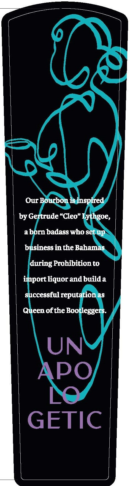
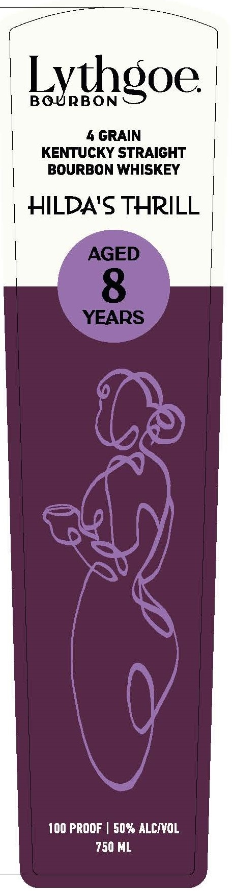
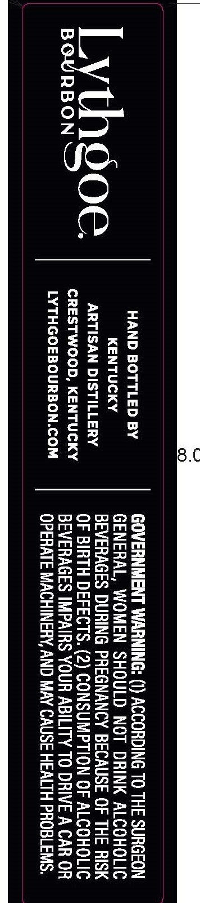
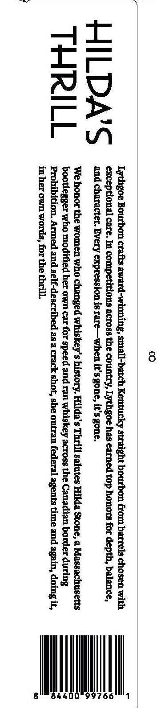

# TTB COLA Label Images - TTBID 26245001000388

**Brand Name:** LYTHGOE

**Fanciful Name:** HILDA'S THRILL

**Issue Date:** 09/10/2026

**Origin Code:** 22

**Product Class/Type:** 101

**Source:** [TTB Public COLA Registry](https://ttbonline.gov/colasonline/viewColaDetails.do?action=publicFormDisplay&ttbid=26245001000388)

## Label Images

### Back Label

### Front Label

### Label 2

### Label 4

## Extracted Label Text

*Text extracted via OCR - may contain errors*

**Detected Proof:** 100
**Detected Age:** 8 Years

### Back Label

Our Bourbon
inspired
by Gertrude "Cleo" Lythgoe,
aborn badass who set up
business in the Bahamas
during Prohibition to
importliquor andbuilda
successful reputation as
ueen of the Bootlegger:
UN
APO
GETIC

### Front Label

Lythgoe
4 GRAIN
KENTUCKY STRAIGHT
BOURBON WHISKEY
HILDA'S THRILL
AGED
8
YEARS
100 PROOF
50% ALCIVOL
750 ML

### Label 2

dene soreD Ey GOVERNMENT WARNING: (I) ACCORDING TO THE SURGEON

eens GENERAL, WOMEN SHOULD NOT DRINK ALCOHOLIC
L th oe petriican wiecil CAE? BEVERAGES DURING PREGNANCY BECAUSE OF THE RISK
bay MA * | cresrwooo, kentucky | OF BIRTH DEFECTS. (2) CONSUMPTION OF ALCOHOLIC

BEVERAGES IMPAIRS YOUR ABILITY TO DRIVE A CAR OR
EYTHGOEBOURBON:COM OPERATE MACHINERY, AND MAY CAUSE HEALTH PROBLEMS.

### Label 4

0

HILDA’S
THRILL

Lythgoe Bourbon crafts award-winning, small-batch Kentucky straight bourbon from barrels chosen with
exceptional care. In competitions across the country, Lythgoe has earned top honors for depth, balance,
and character. Every expression is rare—when it's gone, it's gone.

‘We honor the women who changed whiskey's history. Hilda's Thrill salutes Hilda Stone, a Massachusetts
bootlegger who modified her own car for speed and ran whiskey across the Canadian border during
Prohibition. Armed and self-described as a crack shot, she outran federal agents time and again, doing it,
in her own words, for the thrill.

| 1

—-
——
San
=—Ss

44
