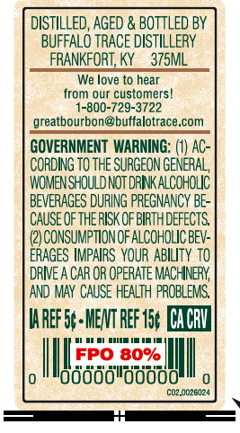
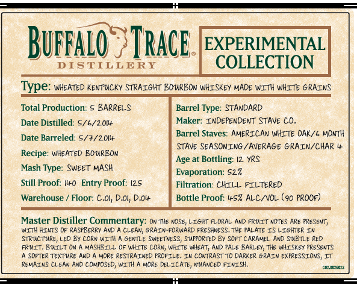

# TTB COLA Label Images - TTBID 26245001000391

**Brand Name:** BUFFALO TRACE DISTILLERY EXPERIMENTAL COLLECTION

**Issue Date:** 09/10/2026

**Origin Code:** 22

**Product Class/Type:** 101

**Source:** [TTB Public COLA Registry](https://ttbonline.gov/colasonline/viewColaDetails.do?action=publicFormDisplay&ttbid=26245001000391)

## Label Images

### Back Label

### Front Label

## Extracted Label Text

*Text extracted via OCR - may contain errors*

### Back Label

DISTILLED, AGED & BOTTLED BY
BUFFALO TRACE DISTILLERY
FRANKFORT, KY
375ML
We love to hear
from our customers
-800-729-3722
greatbourbon@buffalotrace,com
GOVERNMENT  WARNING: (1) AC-
CORDING TO THE SURGEON GENERAL,
WOMENSHOULD NOT DRNK ALCOHOLIC
BEVERAGES DURING PREGNANCY BE-
CAUSE OFTHERISK OFBIRTHDEFECTS
CONSUMPTION OF AlCOHOLIC BEV:
ERAGES IMPAIRS  YOUR  ABILITY to
dRIE A CAR OR OpeRATE MACHNERY
AND MAY CAUSE HEALTH  PROBLEMS
HaREf5+MENT REF 15, CACbV
FPO 80%
loddddldobdd
C02.0026124

### Front Label

BuffaLo
TRacE.
EXPERIMENTAL
DISTILLE RY
COLLECTION
Type: wHeated KENTuCKy STRAIGHT BOMREON WHISKEY MADE WITH WHITE GRAINS
Total Production:
BARRELS
Barrel Typez
STANDARD
Date Distilled: 5/6/201+
Maker: INDependent Stave Cd_
Barrel
Staves: AMERICAN WHITE OAK/6 MONTH
Date Barreled: 5/3/201+
STave SEASONING / AVERAGE GRAIN/CHAR
Recipe: WHeATED BOURBON
Age at Bottling:
YrS
Mash Type: SWeeT MASH
Evaporation: 522
Still Proof: (l+O
Entry Proof: I25
Filtration: CHILL FILTERED
Warehouse
Floor:
Dol
Bottle Proof: L+S? ALC /VOL (90 Prdof)
Master Distiller Commentary: ON Tle AoSe; LIGIT F_ORAL And RRUIT notes Are Present;
WIT4 HINTS OF RASPBeRRY AnD
CLEAN; GRAIN-FORWARD Freshness, The PALATE Is LIGHTER In
STRuCTuRe LeD By COR" WT7H
GenLe Swieetress; Stfpcrted Ey ScFT Caranel Ard SubTLE Red
FRUIT. BuILT Cv
MASHBILL Of WHITE orm; Wicte Wheat, And PalE Sarl-Ey; The WiISkey Presents
Softe? TextuRe ANd
MORe ReSTRAINE) FROFILE_
In contrastto Darker SRAIN EXFRESSIONS It
REMAINS CLEAN And Composed; WITH
MCRE DELIcate, NMANCED FINISH;
Ceeereor
CI;
DC
