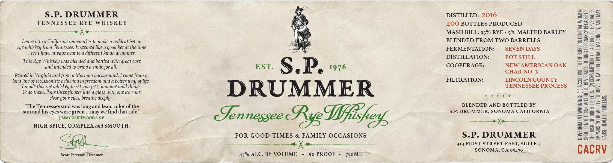

# TTB COLA Label Images - TTBID 26245001000444

**Brand Name:** S. P. DRUMMER

**Issue Date:** 10/05/2026

**Origin Code:** 01

**Product Class/Type:** 142

**Source:** [TTB Public COLA Registry](https://ttbonline.gov/colasonline/viewColaDetails.do?action=publicFormDisplay&ttbid=26245001000444)

## Label Images

### Label 1

## Extracted Label Text

*Text extracted via OCR - may contain errors*

**Detected Proof:** 90

### Label 1

S.P: DRUMMER
DISTILLED: 2016
1
3
TENNES SEE
RYE
WHISKEY
BOTTLES PRODUCED
81
3
MASH BILL: 95% RYE
5% MALTED BARLEY
Leave it to a California winemaker to make a wildcat bet on
BLENDED FROM TWO BARRELLS
m
rye whiskey from Tennessee: It seemed like a
bet at the time
FERMENTATION:
SEVEN DAYS
"SCe
have
beat to a different kinda drummer:
5
1
This Rye Whiskey was blended and bottled with great care
DISTILLATION:
POT STILL
1
and intended to bring a smile for all
EST.
S.P:
1976
COOPERAGE:
NEW AMERICAN OAK
P
5
Reared in Virginia and from a Mormon background,
come from a
CHAR NO. 3
0
3
line of secessionists believing in freedom and a better way of life:
FILTRATION:
LINCOLN COUNTY
Imade this rye
whiskey to set you free; imagine wild
Ecuge,
DRUMMER
TENNESSEE PROCESS
8
do them Pour three fingers into a glass with one ice
=
close your eyes; breathe deeply-
0
"The Tennessee stud was
and lean, color ofthe
BLENDED AND BOTTLED BY
0
11
sun and his eyes were green _ may we find that ride"
Eennessee
S.P: DRUMMER, SONOMA CALIFORNIA
28
JIMMY DRIFTWOOD & SP
Fe52
0
HIGH SPICE, COMPLEX and SMOOTH_
FOR GOOD TIMES & FAMILY OCCASIONS
S.P. DRUMMER
8i
414 FIRST STREET EAST; SUITE 4
SONOMA, CA 95476
CACRV
Scott Peterson; Dreamer
45% ALC. BY VOLUME
90 PROOF
750ML
400
good
always
long
 long ;
IGshets
Reg
