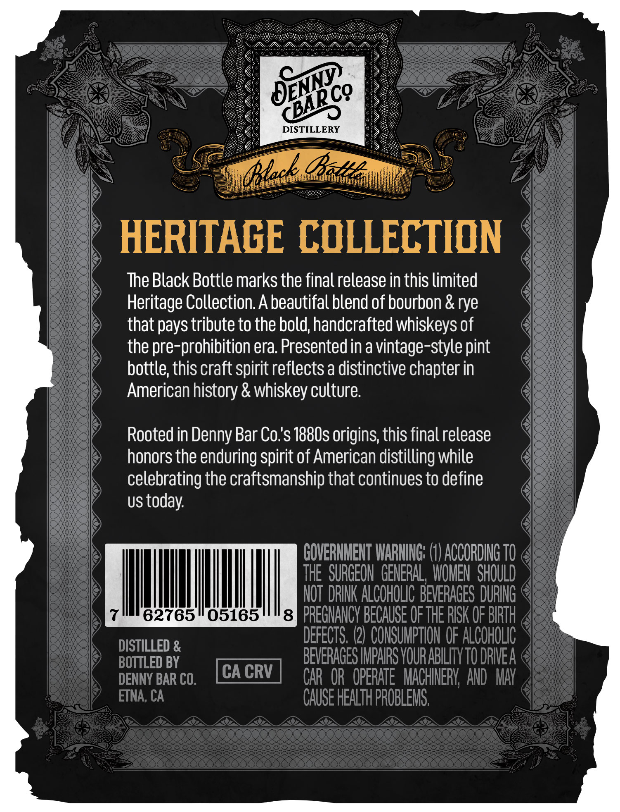
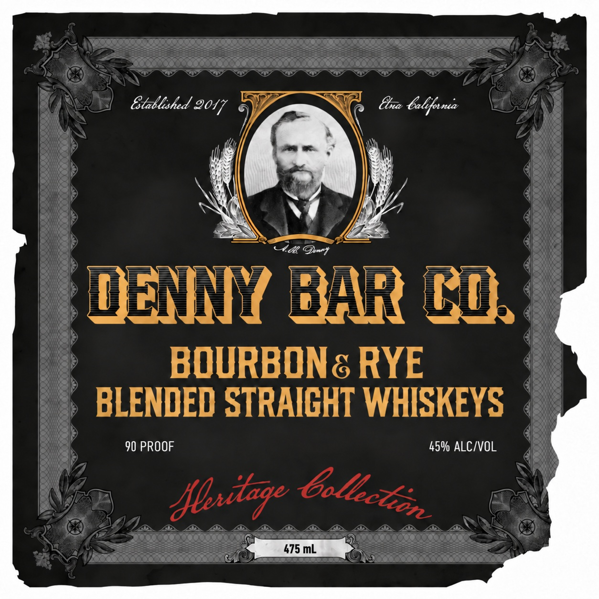
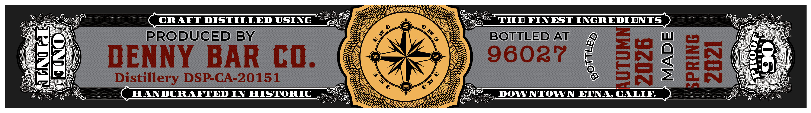

# TTB COLA Label Images - TTBID 26245001000454

**Brand Name:** DENNY BAR CO.

**Fanciful Name:** BOURBON & RYE

**Issue Date:** 09/19/2026

**Origin Code:** 01

**Product Class/Type:** 120

**Source:** [TTB Public COLA Registry](https://ttbonline.gov/colasonline/viewColaDetails.do?action=publicFormDisplay&ttbid=26245001000454)

## Label Images

### Back Label

### Label 1

### Label 3

## Extracted Label Text

*Text extracted via OCR - may contain errors*

*1 image(s) excluded: text did not meet readability threshold*

**Detected Proof:** 90

### Back Label

0
DISTILLERY
Bat
HERITAGE COLLECTION
The Black Bottle marks the final release in this limited
Heritage Collection. A beautifal blend of bourbon & rye
that pays tribute to the bold; handcrafted whiskeys of
the pre-prohibition era Presented in a vintage-style pint
bottle this craft spirit reflects a distinctive chapter in
American history & whiskey culture
Rooted in Denny Bar Co's 188Os origins; this finalrelease
honors the enduring spirit of American distilling while
celebrating the craftsmanship that continues to define
US
today:
GOVERHMEHT IARNNG: (1) ACCORDING TO
THE   SURGEON  GENERAL, WOMEN SHOULD
NOT  DRINK ALCOHOLIC BEVERAGES DURING
62765
05165
8] PREGNANCV BECAUSE OF THE RISK OF BIRTH
DEFECTS, (2) CONSUMPTHON OF ALCOHOLIC
DISTILLED &
BOTTLED BY
BEVERACES IMPARS VOURABILITV TO DRIEA
DENNY BAR CO.
CA CRV
CAR  OR_ OpERATE   MACHINERV  AND  MaY
ETNA; CA
CAUSE HEALTH PROBLEMS:
DENY}
(BAPC?
Black

### Label 1

Btallshed 9047
Eba Galfouna
Yac @~t
DENNY BAR cd
BOURBON& RYE
BLENDED STRAIGHT WHISKEYS
90 PROOF
45% ALCIVOL
Mlitzge
475 mL
bollclon
