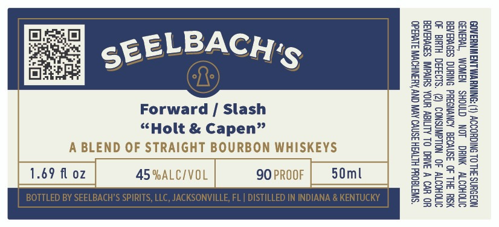

# TTB COLA Label Images - TTBID 26245001000468

**Brand Name:** SEELBACH'S

**Fanciful Name:** FORWARD SLASH

**Issue Date:** 09/23/2026

**Origin Code:** 16

**Product Class/Type:** 121

**Source:** [TTB Public COLA Registry](https://ttbonline.gov/colasonline/viewColaDetails.do?action=publicFormDisplay&ttbid=26245001000468)

## Label Images

### Label 1

## Extracted Label Text

*Text extracted via OCR - may contain errors*

### Label 1

GOVERNMENT WARNING: (1) ACCORDING TO THE SURGEON
GENERAL, WOMEN SHOULD NOT DRINK ALCOHOLIC
BEVERAGES DURING PREGNANCY BECAUSE OF THE RSK
OF BIRTH DEFECTS. (2) CONSUMPTION OF ALCOHOLIC
BEVERAGES IMPAIRS YOUR ABILITY TO DRIVE A CAR OR
OPERATE MACHINERY, AND MAY CAUSE HEALTH PROBLEMS.

£
a
&
s
wn
~
b)
-
6
s
~~
°o
a

wn
2
iu
=
ce
=
=
Lo
Sa
© &
a>

t=)
6a

=
Bx

Oo
Sa
Sox
re
$a
Mey
o
a
2
Fre
m
=<
