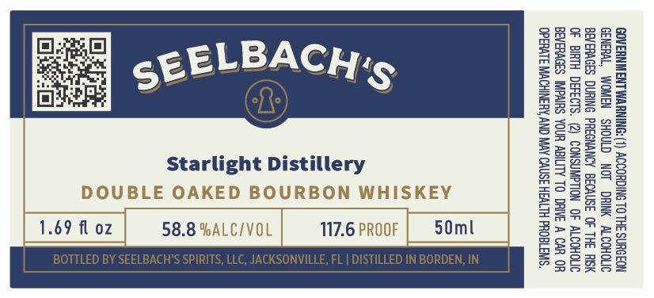

# TTB COLA Label Images - TTBID 26245001000489

**Brand Name:** SEELBACH'S

**Fanciful Name:** STARLIGHT

**Issue Date:** 09/18/2026

**Origin Code:** 16

**Product Class/Type:** 141

**Source:** [TTB Public COLA Registry](https://ttbonline.gov/colasonline/viewColaDetails.do?action=publicFormDisplay&ttbid=26245001000489)

## Label Images

### Label 1

## Extracted Label Text

*Text extracted via OCR - may contain errors*

**Detected Proof:** 117.6

### Label 1

GOVERNMENT WARNING: (1) ACCORDING TO THE SURGEON
GENERAL, WOMEN SHOULD NOT DRINK ALCOHOLIC
BEVERAGES DURING PREGNANCY BECAUSE OF THE RSK
OF BIRTH DEFECTS. (2) CONSUMPTION OF ALCOHOLIC
BEVERAGES IMPAIRS YOUR ABILITY TO DRIVE A CAR OR
OPERATE MACHINERY, AND MAY CAUSE HEALTH PROBLEMS.

50ml

117.6 PROOF

>
Ww
x
nn
=
p=
z
go
= ©
Gry es
=>
Qo
“nm
£
0 2
6 <a
a°
Wu
al
a
=)
°
a

58.8 %ALC/VOL |
