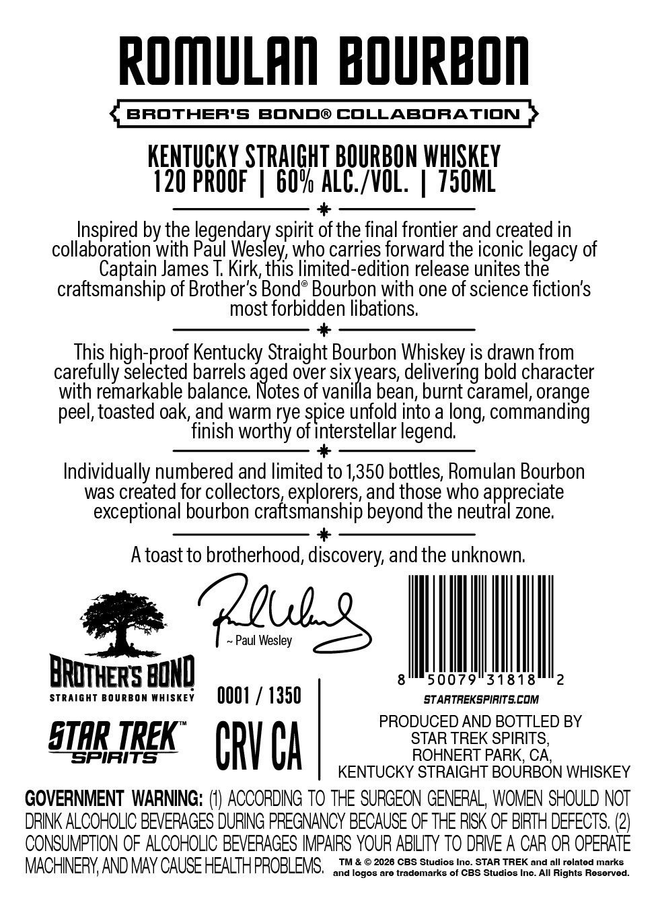
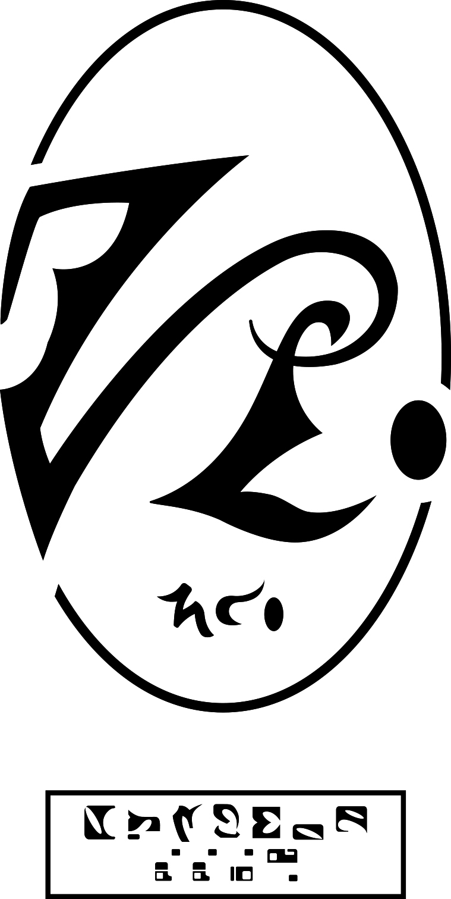

# TTB COLA Label Images - TTBID 26245001000506

**Brand Name:** STAR TREK

**Fanciful Name:** BROTHERS BOND COLLABORATION

**Issue Date:** 09/17/2026

**Origin Code:** 01

**Product Class/Type:** 101

**Source:** [TTB Public COLA Registry](https://ttbonline.gov/colasonline/viewColaDetails.do?action=publicFormDisplay&ttbid=26245001000506)

## Label Images

### Back Label

### Front Label

## Extracted Label Text

*Text extracted via OCR - may contain errors*

*1 image(s) excluded: text did not meet readability threshold*

**Detected Proof:** 120

### Back Label

ROMULAn  bOuRbOn
BROTHER'S
BONDO COLLABORATION
KentuCKY STRAIGHT BOURBON WHISKEY
120 PROOF
60* ALC_/VOl,
750ML
Inspired by the legendary spirit ofthe final frontier and created in
collaboration with Paul Wesley, who carries forward the iconic legacy of
Captain James T Kirk;this limited-edition release unites the
craftsmanship of Brother's Bonde Bourbon with one of science fiction's
most forbidden libations:
This high-proof Kentucky Straight Bourbon Whiskey is drawn from
carefully selected barrels
a8ccs
over six years, delivering bold character
with remarkable balance:
of vanilla bean; burnt caramel, orange
peel, toasted oak, and warm rye spice unfold into a long, commanding
finish worthy of interstellar legend
Individually numbered and limited to 1,350 bottles; Romulan Bourbon
was created for collectors explorers, and those who appreciate
exceptional bourbon craftsmanship beyond the neutral zone;
A toast to brotherhood, discovery, andthe unknown:
pdul_s
Paul Wesley
BRDTHERS BONQ
50079
318 18
2
Straight BoUrbon MHISKEY
OOO
1350
StArtrekspirits coM
PRODUCED AND BOTTLED BY
SAR
SPIRITS
TREK"
CRV Ca
Sorerek aRiRICS
KENTUCKY STRAIGHT BOURBON WHISKEY
GOVERNMENT WARNING: (I) ACCORDING To THE SURGEON GENERAL, WOMEN SHOULD NOT
DRINK ALCOHOLIC BEVERAGES DURING PREGNANCY BECAUSE OF THE RISK OF BIRTH DEFECTS; (2)
CONSUMPTION OF ALCOHOLIC BEVERAQES IMPAIRS YOUR ABILITY TO DRIVE A CAR OR OPERATE
MACHINERY AND May CAUSE HEALTH PROBLEMS,
TM & @ 2026 CBS Studios Ino_
STAR TREK and all related marks
and logos are trademarks of CBS Studios Ino. All Rights Reserved:
