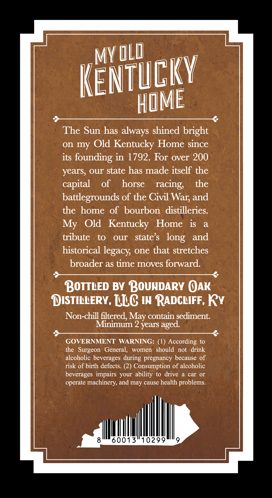
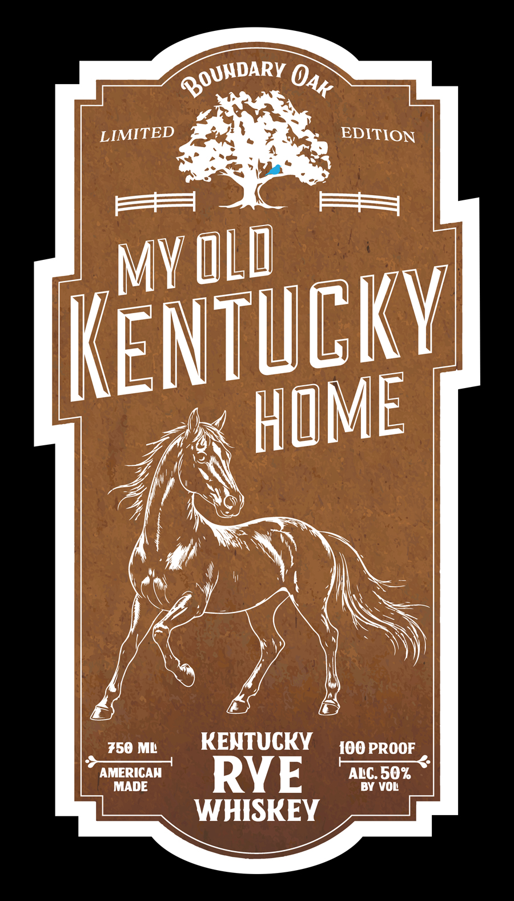

# TTB COLA Label Images - TTBID 26245001000554

**Brand Name:** MY OLD KENTUCKY HOME

**Issue Date:** 09/14/2026

**Origin Code:** 22

**Product Class/Type:** 142

**Source:** [TTB Public COLA Registry](https://ttbonline.gov/colasonline/viewColaDetails.do?action=publicFormDisplay&ttbid=26245001000554)

## Label Images

### Back Label

### Front Label

## Extracted Label Text

*Text extracted via OCR - may contain errors*

**Detected Age:** 2 Years

### Back Label

MY
Kentucky
The Sun has always shined bright
on my Old
Kentucky Home since
its founding in 1792.
For over 200
years, our state has made itself the
capital
of
horse
racing;
the
battlegrounds of the Civil
and
the home of bourbon distilleries:
Old   Kentucky
Home
iS
a
tribute
to
our
state $
and
historical
one that stretches
broader as time moves forward:
BOTTLED BY BOUNDARY OAK
DISTILLERY, LLC IN RADCLIFF, Ry
Non-chill filtered,
contain sediment:
Minimum 2 years aged
GOVERNMENT
WARNING: (1) According to
the   Surgeon  General,
women
should  not
drink
alcoholic beverages during pregnancy because of
risk of birth defects. (2) Consumption of alcoholic
beverages  impairs your ability to drive
car Or
operate machinery; and may cause health problems
60013
10299
@Ld
HOME
War;
My
long
legacy
May

### Front Label

LIMITED
EDITION
F
Kentuckvi
750 ML
KENTUCKY
I0O PROOF
AMERICAN
RYE
ALC. 50%
MADE
BY VOL
WHISKEY
BOUNDARY
OAK
MY Old
HOME
