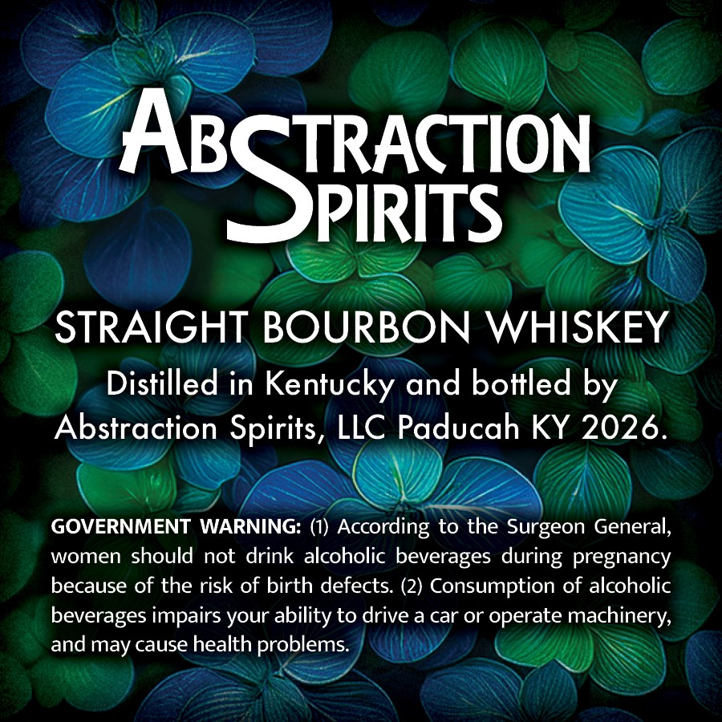
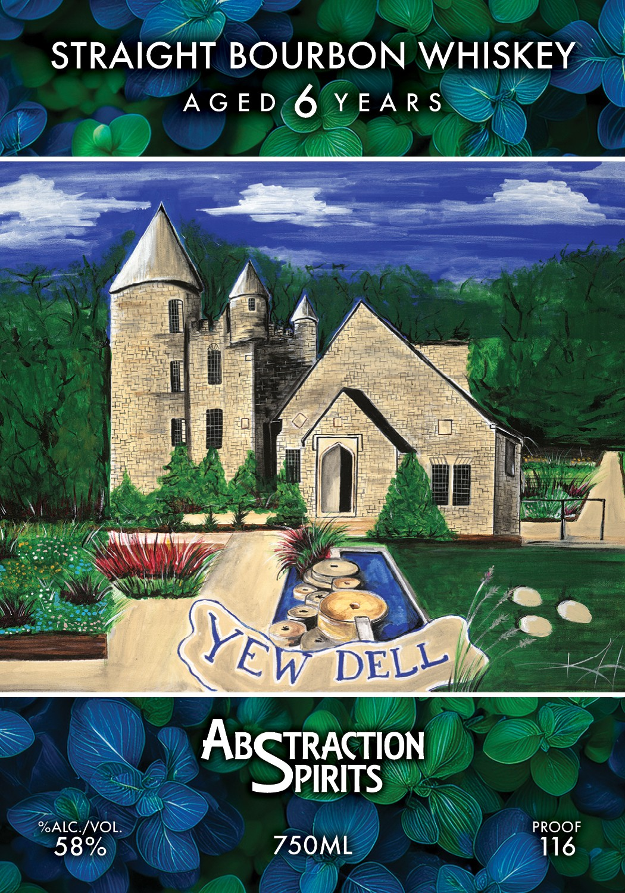

# TTB COLA Label Images - TTBID 26245001000649

**Brand Name:** ABSTRACTION SPIRITS

**Fanciful Name:** YEW DELL

**Issue Date:** 09/11/2026

**Origin Code:** 22

**Product Class/Type:** 101

**Source:** [TTB Public COLA Registry](https://ttbonline.gov/colasonline/viewColaDetails.do?action=publicFormDisplay&ttbid=26245001000649)

## Label Images

### Back Label

### Front Label

## Extracted Label Text

*Text extracted via OCR - may contain errors*

*1 image(s) excluded: text did not meet readability threshold*

### Back Label

ABSTRToN
STRAIGHT BOURBON WHISKEY
Distilled in Kentucky and bottled by
Abstraction Spirits, LLC Paducah KY 2026.
GOVERNMENT WARNING: (1) According to the Surgeon General,
women should not drink alcoholic beverages during pregnancy
because of the risk of birth defects: (2) Consumption of alcoholic
beverages impairs
ability to drive a car or operate machinery,
and may cause health problems
your
