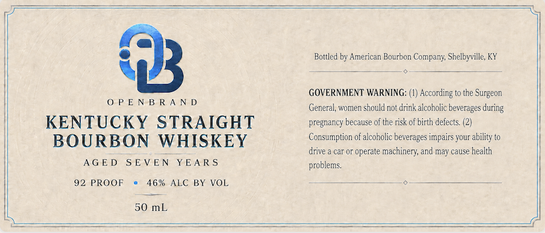

# TTB COLA Label Images - TTBID 26246001000132

**Brand Name:** OPENBRAND

**Issue Date:** 09/11/2026

**Origin Code:** 22

**Product Class/Type:** 101

**Source:** [TTB Public COLA Registry](https://ttbonline.gov/colasonline/viewColaDetails.do?action=publicFormDisplay&ttbid=26246001000132)

## Label Images

### Label 1

## Extracted Label Text

*Text extracted via OCR - may contain errors*

**Detected Proof:** 92

### Label 1

OPENBRAND

KENTUCKY STRAIGHT
BOURBON WHISKEY
AGED SEVEN YEARS

92 PROOF © 46% ALC BY VOL

50 mL

Bottled by American Bourbon Company, Shelbyville, KY

GOVERNMENT WARNING: (1) According to the Surgeon
General, women should not drink alcoholic beverages during
pregnancy because of the risk of birth defects. (2)
Consumption of alcoholic beverages impairs your ability to
drive a car or operate machinery, and may cause health
problems
