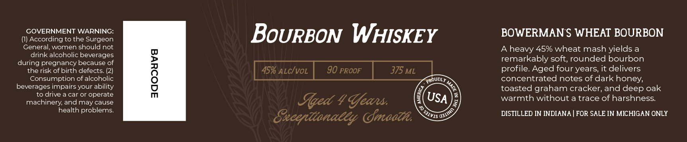

# TTB COLA Label Images - TTBID 26246001000201

**Brand Name:** BOWERMAN FARMS DISTILLERY

**Issue Date:** 09/11/2026

**Origin Code:** 06

**Product Class/Type:** 141

**Source:** [TTB Public COLA Registry](https://ttbonline.gov/colasonline/viewColaDetails.do?action=publicFormDisplay&ttbid=26246001000201)

## Label Images

### Label 1

### Label 2

## Extracted Label Text

*Text extracted via OCR - may contain errors*

**Detected Proof:** 90

### Label 1

gOWERMAyy
Gaus
DISTILLERY
BOTTLED BY BOWERMAN
FARMS DISTILLERY IN
Hlittanit, LAletigan

### Label 2

IGOVERNENThARNI;
BoURBON WHISKEY
BOWERMAN S WHEAT BOURBON
General, women should not
45% wheat mash yields a
drink alcoholic beverages
remarkably soft, rounded bourbon
during pregnancy because of
therisk of birth defects_
L
45% ALcIvoL
90 PROOF
375 ML
profile Aged four years; it delivers
Consumption of alcoholic
PROUdly
concentrated notes of dark honey;
beverages impairs your ability
toasted graham cracker, and deep oak
drive a car or operate
Jed 4 Uea
USA
warmth without a trace of harshness:
machinery; and may cause
health problems:
Seeegttenaeey Gmcath
DISTILLED IN INDIANA
FOR SALE IN MICHIGAN ONLY
heavy
0
QJIINO
SJIVIS =
