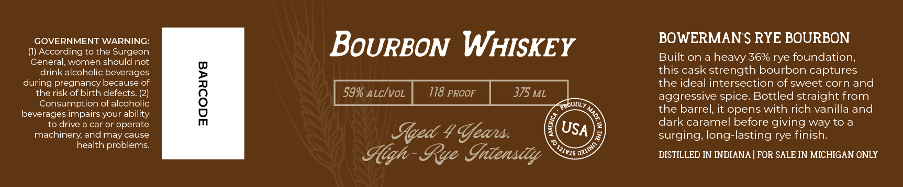

# TTB COLA Label Images - TTBID 26246001000207

**Brand Name:** BOWERMAN FARMS DISTILLERY

**Issue Date:** 09/14/2026

**Origin Code:** 06

**Product Class/Type:** 141

**Source:** [TTB Public COLA Registry](https://ttbonline.gov/colasonline/viewColaDetails.do?action=publicFormDisplay&ttbid=26246001000207)

## Label Images

### Label 1

### Label 2

## Extracted Label Text

*Text extracted via OCR - may contain errors*

**Detected Proof:** 118

### Label 1

gOWERMAyy
Gaus
DISTILLERY
BOTTLED BY BOWERMAN
FARMS DISTILLERY IN
Hlittanit, LAletigan

### Label 2

GOVERNMENT WARNING:
BoURBON WHISKEY
BOWERMAN S RYE BOURBON
According to the Surgeon
General, women should not
Built on a heavy 36% rye foundation
drink alcoholic beverages
this cask strength bourbon captures
during pregnancy because of
the ideal intersection of sweet corn and
therisk of birth defects_

59% ALcIvoL
118 PROOF
375 ML
aggressive spice Bottled straight from
Consumption of alcoholic
CRoudly
the barrel, it opens with rich vanilla and
beverages impairs your ability
to drive a car or operate
dark caramel before giving way to a
machinery; and
cause
Iqed 4 %eans
USA
surging; long-lasting rye finish:
health problems:
Gqh- Rye Iateasdly
DISTILLED IN INDIANA
FOR SALE IN MICHIGAN ONLY
0
may
'QJIINO
SJIVIS =
