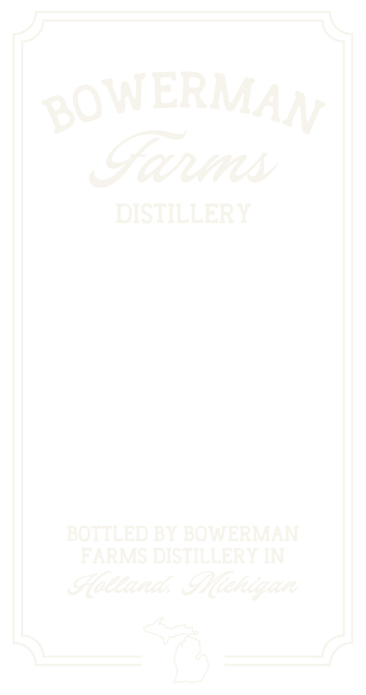
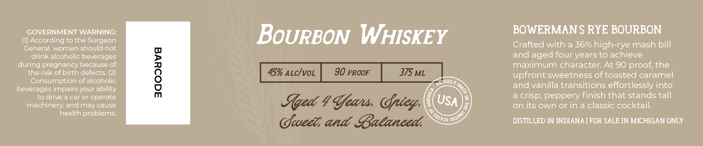

# TTB COLA Label Images - TTBID 26246001000219

**Brand Name:** BOWERMAN FARMS DISTILLERY

**Issue Date:** 09/11/2026

**Origin Code:** 06

**Product Class/Type:** 141

**Source:** [TTB Public COLA Registry](https://ttbonline.gov/colasonline/viewColaDetails.do?action=publicFormDisplay&ttbid=26246001000219)

## Label Images

### Label 1

### Label 2

## Extracted Label Text

*Text extracted via OCR - may contain errors*

**Detected Proof:** 90

### Label 1

gOWERMAyy
Gaus
DISTILLERY
BOTTLED BY BOWERMAN
FARMS DISTILLERY IN
Hlittanit, LAletigan

### Label 2

GOVERNMENT WARNING:
BoURBON WHISKEY
BOWERMAN $ RYE BOURBON
According to the Surgeon
General; women should not
Crafted with a 36% high-rye mash bill
drink alcoholic beverages
and aged four years to achieve
during pregnancy because of
maximum character: At 90 proof; the
the risk of birth defects_
L
45% ALcIvoL
90 PROOF
375 ML
upfront sweetness of toasted caramel
Consumption of alcoholic
PRoUdly
beverages impairs your ability
and vanilla transitions effortlessly into
to drive & car or operate
peppery finish that stands tall
machinery; and may cause
Iqed 4 Ueans Ortey,
USA
on its own or in a classic cocktail;
health problems
fwee; and Gaeanced,
DISTILLED IN INDIANA
FOR SALE IN MICHIGAN ONLY
1
crisp;
Qalino
'SJ1VIS =
