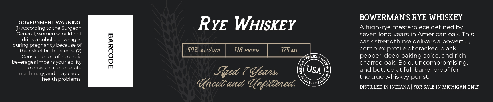

# TTB COLA Label Images - TTBID 26246001000228

**Brand Name:** BOWERMAN FARMS DISTILLERY

**Issue Date:** 09/14/2026

**Origin Code:** 06

**Product Class/Type:** 142

**Source:** [TTB Public COLA Registry](https://ttbonline.gov/colasonline/viewColaDetails.do?action=publicFormDisplay&ttbid=26246001000228)

## Label Images

### Label 1

### Label 2

## Extracted Label Text

*Text extracted via OCR - may contain errors*

**Detected Proof:** 118

### Label 1

gOWERMAyy
Gaus
DISTILLERY
BOTTLED BY BOWERMAN
FARMS DISTILLERY IN
Hlittanit, LAletigan

### Label 2

BOWERMAN S RYE WHISKEY
IGOVCrrngENThARNeO
RYE WHISKEY
A high-rye masterpiece defined by
General, women should not
seven
long years in American oak This
drink alcoholic beverages
cask strength rye delivers a powerful,
during pregnancy because of
therisk of birth defects_
1
59% ALcIvoL
118 PROOF
375 ML
complex profile of cracked black
Consumption of alcoholic
QROUDLY
pepper; deep baking spice, and rich
beverages impairs your ability
charred oak Bold, uncompromising;
drive a car or operate
Sqed 7 %eas:
USA
and bottled at full barrel proof for
machinery; and may cause
health problems:
the true whiskey purist:
(acc and Ungietened
DISTILLED IN INDIANA
FOR SALE IN MICHIGAN ONLY
1
OJIINO
SJ1VIS "
