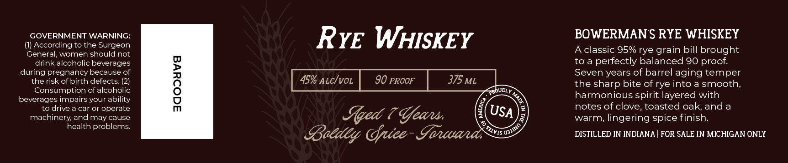

# TTB COLA Label Images - TTBID 26246001000238

**Brand Name:** BOWERMAN FARMS DISTILLERY

**Issue Date:** 09/11/2026

**Origin Code:** 06

**Product Class/Type:** 142

**Source:** [TTB Public COLA Registry](https://ttbonline.gov/colasonline/viewColaDetails.do?action=publicFormDisplay&ttbid=26246001000238)

## Label Images

### Label 1

### Label 2

## Extracted Label Text

*Text extracted via OCR - may contain errors*

**Detected Proof:** 90

### Label 1

gOWERMAyy
Gaus
DISTILLERY
BOTTLED BY BOWERMAN
FARMS DISTILLERY IN
Hlittanit, LAletigan

### Label 2

GOVERNMENT WARNING:
RYE WHISKEY
BOWERMAN S RYE WHISKEY
According to the Surgeon
General, women should not
A classic 95% rye grain bill brought
drink alcoholic beverages
toa
perfectly balanced 90 proof:
during pregnancy because of
Seven years of barrel aging temper
therisk of birth defects_
1
45% ALcIvoL
90 PROOF
375 ML
the sharp bite of rye into a smooth;
Consumption of alcoholic
QRoUDLY
beverages impairs your ability
harmonious spirit layered with
drive a car or operate
notes f clove, toasted oak, and a
machinery; and may cause
Sqed ? Gfeau:
USA
warm, lingering spice finish:
health problems:
Boedey Onice - Goncaal
DISTILLED IN INDIANA
FOR SALE IN MICHIGAN ONLY
1
OJIINO
SAIVIS "
