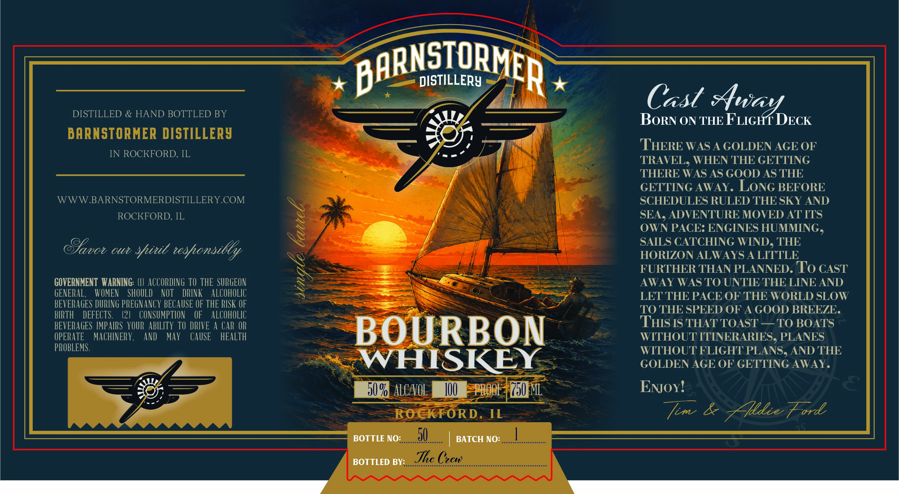

# TTB COLA Label Images - TTBID 26246001000261

**Brand Name:** BARNSTORMER DISTILLERY

**Issue Date:** 09/14/2026

**Origin Code:** 04

**Product Class/Type:** 141

**Source:** [TTB Public COLA Registry](https://ttbonline.gov/colasonline/viewColaDetails.do?action=publicFormDisplay&ttbid=26246001000261)

## Label Images

### Label 1

## Extracted Label Text

*Text extracted via OCR - may contain errors*

### Label 1

BARNSIORMER
DISTILLERY
Cast Away
DISTILLED
HAND BOTTLED BY
BORN ON THE FLIGHT DECK
BARNSTORMER DISTILLERy
THERE WAS A GOLDEN AGE OF
IN ROCKFORD, IL
TRAVEL, WHEN THE GETTING
THERE WAS AS GOOD AS THE
GETTING AWAY. LONG BEFORE
WWW BARNSTORMERDISTILLERY COM
SCHEDULES RULED THE SKY AND
ROCKFORD, IL
SEA, ADVENTURE MOVED ATITS
<
OWN PACE: ENGINES HUMMING ,
SAILS CATCHING WIND, THE
oui
teshonsilly
HORIZON ALWAYS A LITTLE
FURTHER THAN PLANNED. To CAST
GOVERNMENT   WARNING: (}   ACCORDING TO THE  SURGEON
AWAY WAS TO UNTIE THE LINE AND
GENERaL,
WOMEN
SHOULD
NOT
DRINK
ALCOHOLIC
LET THE PACE OF THE WORLD SLOW
BEVERAGES DURING PREGNANCY BECAUSE OF THE RISK OF
TO THE SPEED OF A GOOD BREEZE .
BIRTH
DEFECTS.
(2)
CONSUMPTION
OF
ALCOHOLIC
BEVERAGES IMPAIRS  YOUR ABILITY TO DRIVE A CAR OR
THIS IS THAT TOAST
TO BOATS
OPERATE
MACHINERY ,
and
May
CAUSE
HEaLTh
BOURBON
WITHOUT ITINERARIES, PLANES
PROBLEMS.
WITHOUT FLIGHT PLANS, AND THE
WHISKEY
GOLDEN AGE OF GETTING AWAY
50 9 ALCAOL
100
HrpoF | Z50mL
ENox
ROcKFORD
IL
[im
Zlie Ford
BOTTLE NO: __
50
BATCH NO:
BOTTLED BY:
The Czew
Gavot
%itt
<
