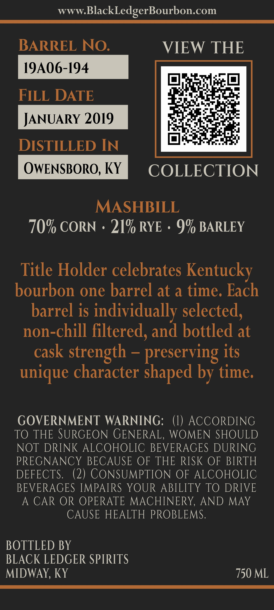
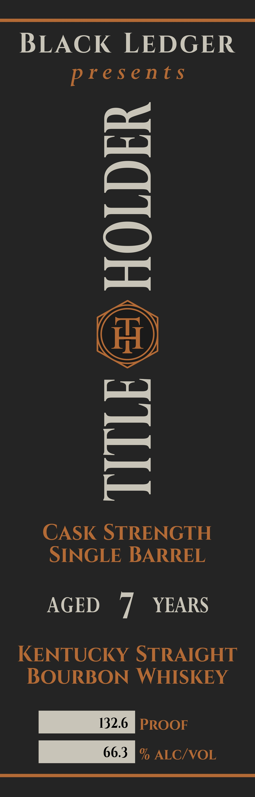

# TTB COLA Label Images - TTBID 26246001000264

**Brand Name:** BLACK LEDGER

**Issue Date:** 09/14/2026

**Origin Code:** 22

**Product Class/Type:** 101

**Source:** [TTB Public COLA Registry](https://ttbonline.gov/colasonline/viewColaDetails.do?action=publicFormDisplay&ttbid=26246001000264)

## Label Images

### Back Label

### Front Label

## Extracted Label Text

*Text extracted via OCR - may contain errors*

**Detected Proof:** 132.6
**Detected Age:** 7 Years

### Back Label

www.BlackLedgerBourbon.com
BARREL NO. VIEW THE
19A06-194
FILL DATE peti
JANUARY 2019 ace?
ah ae
DISTILLED IN Lele ire Fas
OWENSBORO, KY Breve HR XONNO@)N|
MASHBILL
70% CORN + 21% RYE » 9% BARLEY
Title Holder celebrates Kentucky
bourbon one barrel at a time. Each
barrel is individually selected,
non-chill filtered, and bottled at
cask strength - preserving its
unique character shaped by time.
GOVERNMENT WARNING: (1) ACCORDING
TO THE SURGEON GENERAL, WOMEN SHOULD
NOT DRINK ALCOHOLIC BEVERAGES DURING
PREGNANCY BECAUSE OF THE RISK OF BIRTH
DEFECTS. (2) CONSUMPTION OF ALCOHOLIC
BEVERAGES IMPAIRS YOUR ABILITY TO DRIVE
A CAR OR OPERATE MACHINERY, AND MAY
CAUSE HEALTH PROBLEMS.
BOTTLED BY
BLACK LEDGER SPIRITS
MIDWAY, KY 750 ML

### Front Label

BLACK LEDGER

presents

=\
4]

Ig

TITLE =) HOLDER

AS

CASK STRENGTH
SINGLE BARREL

AGED ‘7 YEARS

KENTUCKY STRAIGHT
BOURBON WHISKEY

BPA PROOF

66.3 DAINKOAYe)»
