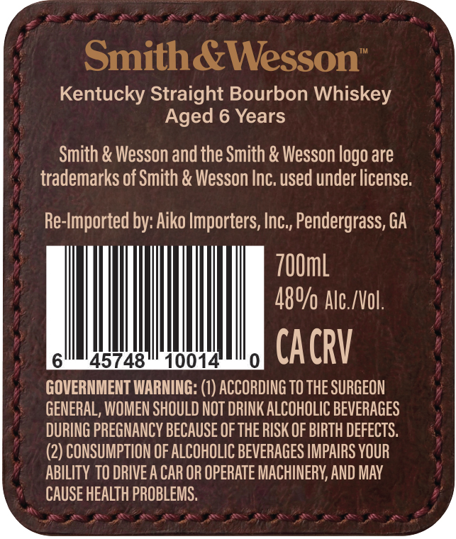
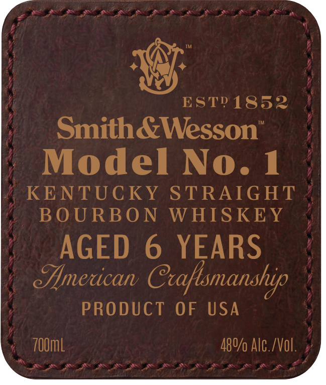
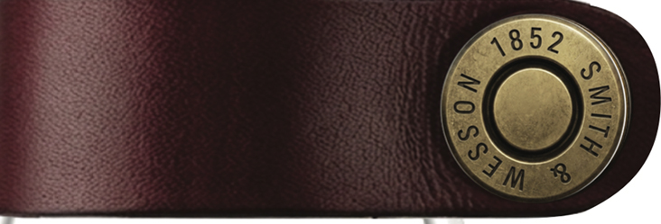

# TTB COLA Label Images - TTBID 26246001000278

**Brand Name:** SMITH & WESSON

**Issue Date:** 09/11/2026

**Origin Code:** 08

**Product Class/Type:** 101

**Source:** [TTB Public COLA Registry](https://ttbonline.gov/colasonline/viewColaDetails.do?action=publicFormDisplay&ttbid=26246001000278)

## Label Images

### Back Label

### Front Label

### Label 3

## Extracted Label Text

*Text extracted via OCR - may contain errors*

*1 image(s) excluded: text did not meet readability threshold*

**Detected Age:** 6 Years

### Back Label

Smith &Wesson’
Kentucky Straight Bourbon Whiskey
Aged 6 Years

Smith & Wesson and the Smith & Wesson logo are
trademarks of Smith & Wesson Inc. used under license.

Re-Imported by: Aiko Importers, Inc., Pendergrass, GA

700m
48%p Alc./Vol.

645748 100147 0 CACRV

GOVERNMENT WARNING: (1) ACCORDING TO THE SURGEON
GENERAL, WOMEN SHOULD NOT DRINK ALCOHOLIC BEVERAGES
DURING PREGNANCY BECAUSE OF THE RISK OF BIRTH DEFECTS.
(2) CONSUMPTION OF ALCOHOLIC BEVERAGES IMPAIRS YOUR
ABILITY TO DRIVE A CAR OR OPERATE MACHINERY, AND MAY
CAUSE HEALTH PROBLEMS.

### Front Label

ESTD 1852
SmithaWesson"
Model No. 1
KENTUCKY
STRAIGHT
BOURBO N
WHISKEY
AGED
6 YEARS
emercan Ctaftsmanship
PRODUCT
OF
USA
7OOmL
480/0 Alc./Vol
