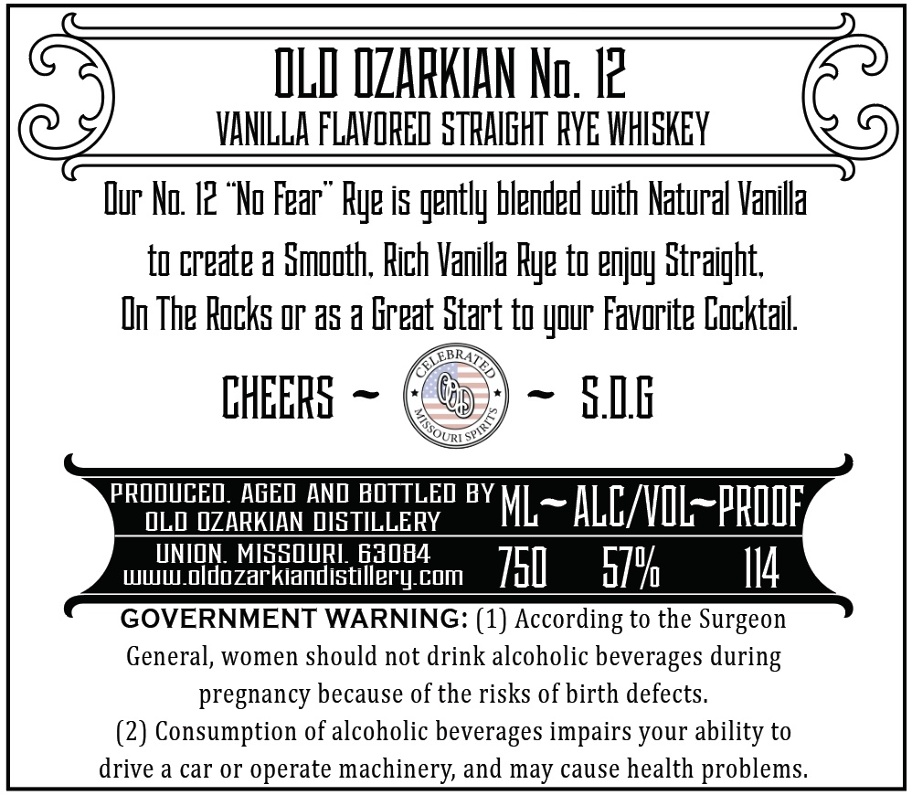
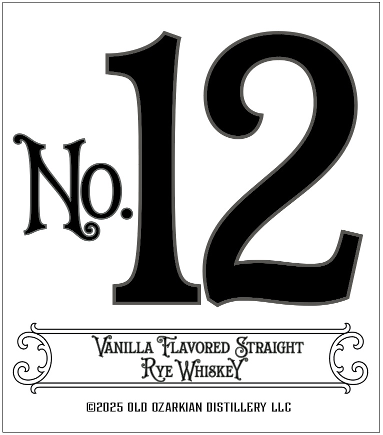

# TTB COLA Label Images - TTBID 26246001000312

**Brand Name:** OLD OZARKIAN DISTILLERY

**Issue Date:** 09/15/2026

**Origin Code:** 29

**Product Class/Type:** 149

**Source:** [TTB Public COLA Registry](https://ttbonline.gov/colasonline/viewColaDetails.do?action=publicFormDisplay&ttbid=26246001000312)

## Label Images

### Back Label

### Front Label

## Extracted Label Text

*Text extracted via OCR - may contain errors*

### Back Label

ILI IZARKHAN Nu. I2
VANLLA FLAVREL STHAIEHT RYE WHSKEY
Dur Ng I2 "To Fear" Rye is gently blended uith Natural Vanilla
tu cteate a Smguth; Rich Vanilla Rye tu enjuy Straight;
In The Rocks Or a5 a Ereat Start t yuur Favorite Eucktail
CHEERS
SIE
PROOUCED. AGED AND BOTTLED BY
OLD @ZARKIAN DISTILLERY
ML
ALL/VIL_prIIF
UNION MISSOURI 63084
www oldozarkiandistillery com
751
570
I14
GOVERNMENT WARNING: (1) According to the Surgeon
General, women should not drink alcoholic beverages during
pregnancy because of the risks of birth defects.
(2) Consumption of alcoholic beverages impairs your
to
drive a car or operate machinery and may cause health problems
ability

### Front Label

VANILLA YLAVoRED rence

Rye WhIsKE

©2025 OLD OZARKIAN DISTILLERY LLC
