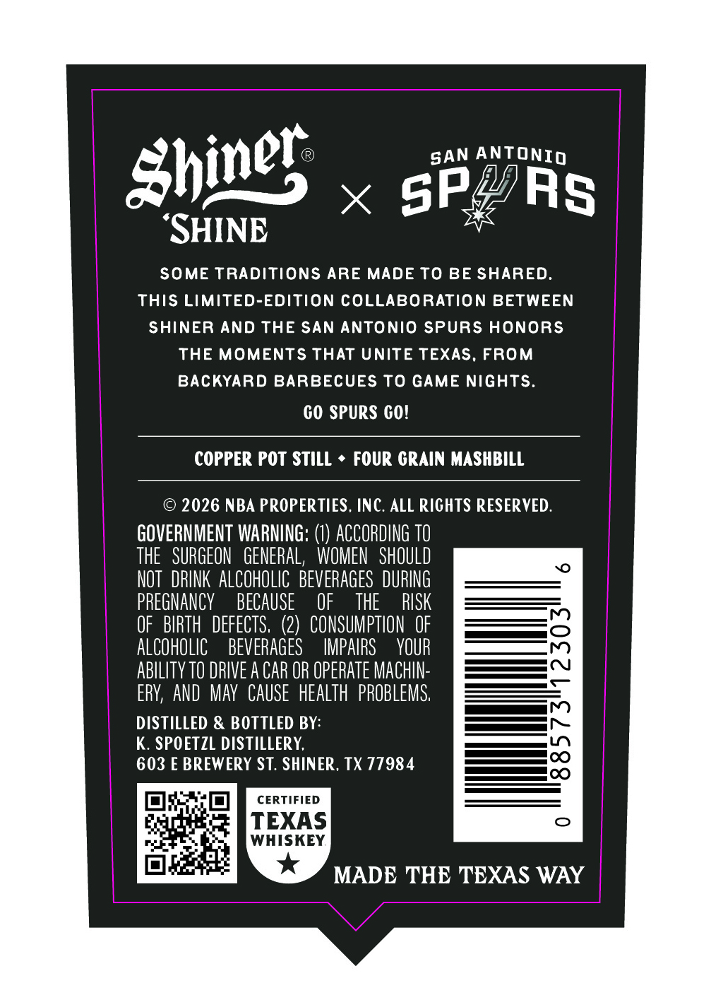
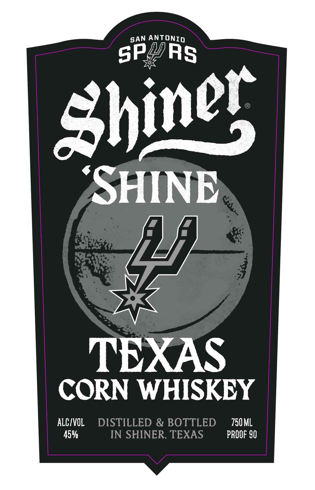

# TTB COLA Label Images - TTBID 26246001000601

**Brand Name:** SHINER

**Issue Date:** 09/10/2026

**Origin Code:** 44

**Product Class/Type:** 143

**Source:** [TTB Public COLA Registry](https://ttbonline.gov/colasonline/viewColaDetails.do?action=publicFormDisplay&ttbid=26246001000601)

## Label Images

### Back Label

### Front Label

## Extracted Label Text

*Text extracted via OCR - may contain errors*

**Detected Proof:** 90

### Back Label

shines
ANTONIO
SPQ
'SHINE
SOME TRADITIONS ARE
MADE To BE SHARED.
This LIMITED-EDITION COLLABORATION BETWEEN
SHINER AND THE SAN Antonio SPUrS honorS
THE MOMENTS THAT UNITE TEXAS, FROM
BACKYARD BARBECUES TO GAME NiGHTS.
60 SPuRS Go!
COPPER Pot STILL
FoUR GRaIN MASHBILL
2026 NBA PROPERTIES, INC. ALL RICHTS RESERVED.
GOVERNMENT WARNING:
ACCORDING TO
THE   SURGEON  GENERAL,
WOMEN  ShOULD
NOT  DRINK ALCOHOLIC BEVERAGES DURING
PREGNANCY
BECAUSE
OF
THE
RISK
OF   BIRTH   DEFECTS, (2)   CONSUMPTION  OF
ALCOHOLIC
BEVERAGES
IMPAIRS
YOUR
AbILITY TO DRIVE A CAR OR OPERATE MAChIN-
ERV, AND  Mav CAUSE   HEALTH  PROBLEMS,
DISTILLED & BOTTLED BY:
K. SPOETZL DISTILLERY,
603 E BREWERY ST. SHINER, TX 77984
CERTIFIED
TEXAS
WHISKEY
MADE THE TEXAS WAY
SAN
Rs

### Front Label

ANTONIO
sP@RS
'SHINE
TEXAS
CORN WHISKEY
ALCIVOL
DISTILLED & BOTTLED
750 ML
459
IN SHINER, TEXAS
PROOF 90
SAN
Shines
