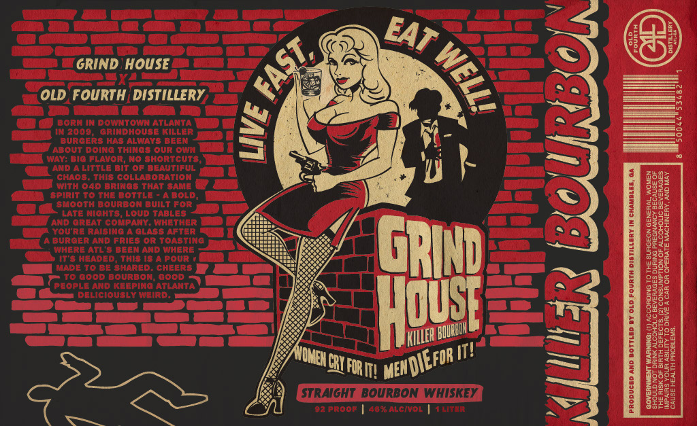

# TTB COLA Label Images - TTBID 26246001000606

**Brand Name:** GRIND HOUSE KILLER BOURBON

**Issue Date:** 09/17/2026

**Origin Code:** 08

**Product Class/Type:** 101

**Source:** [TTB Public COLA Registry](https://ttbonline.gov/colasonline/viewColaDetails.do?action=publicFormDisplay&ttbid=26246001000606)

## Label Images

### Label 1

## Extracted Label Text

*Text extracted via OCR - may contain errors*

### Label 1

GRIND HOUSE
CX
OLD FOURTH DISTILLERY
3
"orcer bowsdoouetceera
4
1
About ooing Thicgs Our Oui
Wav: Bio Flavor, No Jhortcuts
ANd A Little bit Op beautirul
Ghacs: This collaboration
ith 040 Brinds That game
Spirit to the bottle
BoLd;
Smooth bourbon auilt For
ANDAtr eig CoMpond, TabEthcr
1
I
Yovrd Raisina
alase Aftar
Juader Kno Fries Or
Oasting
Inhere AtL'8 bben And Wmhbre
It's headed
This I8
pour
MaoeQood owarodi,
C0Ons
L
peopdelicioubepineirdlanta _
E8
NINOUCRL FORI!
KHLLER
IT!
3
1
9
U
8
STRAIGHT_BOURBON WhISKEY

02 proor
48rAlcival
Ooc
EAT
FAST
1
'MENDIEFOR /
