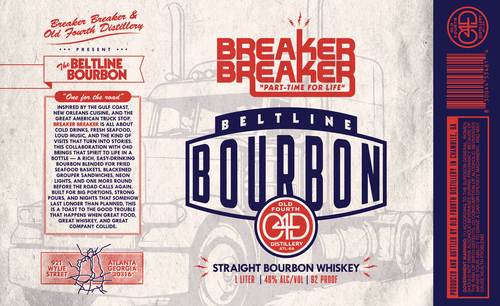

# TTB COLA Label Images - TTBID 26246001000607

**Brand Name:** BELTLINE BOURBON

**Issue Date:** 09/17/2026

**Origin Code:** 08

**Product Class/Type:** 101

**Source:** [TTB Public COLA Registry](https://ttbonline.gov/colasonline/viewColaDetails.do?action=publicFormDisplay&ttbid=26246001000607)

## Label Images

### Label 1

## Extracted Label Text

*Text extracted via OCR - may contain errors*

### Label 1

We

Qf

ao

re

=_

als

08

eee

PRESENT

eee

es S

 ~

|

INSPIRED BY THE GULF COAST,

NEW ORLEANS CUISINE, AND THE

GREAT AMERICAN TRUCK STOP.

IS ALL ABOUT

wow,

ZL >

COLD DRINKS, FRESH SEAFOOD,

2uwOS

LOUD MUSIC, AND THE KIND OF

Onc

3a9

VISITS THAT TURN INTO STORIES.

OS

wz

Wy Lu

THIS COLLABORATION WITH 04D

com>

BRINGS THAT SPIRIT TO LIFE IN A

W>On

O72

BOTTLE — A RICH, EASY-DRINKING

Or

BOURBON BLENDED FOR FRIED

Og

ZLO

Of

SEAFOOD BASKETS, BLACKENED

iL

os

uOs

GROUPER SANDWICHES, NEON

Tau

LIGHTS, AND ONE MORE ROUND

NZ

Oot

BEFORE THE ROAD CALLS AGAIN.

weew

BUILT FOR BIG PORTIONS, STRONG

T5004

Fa-O

POURS, AND NIGHTS THAT SOMEHOW

Onliea

FWSO

LAST LONGER THAN PLANNED, THIS

zHe

IS A TOAST TO THE GOOD TROUBLE

ozs

THAT HAPPENS WHEN GREAT FOOD,

ow

ow

C>ot

ATH

GREAT WHISKEY, AND GREAT

oma

a>

COMPANY COLLIDE.

t5H0

=O

“TOON

OWFS

So

25

wr

zOEm

r290

qZ2-oaoc

-an

roto

fue,

ae

245

STRAIGHT BOURBON WHISKEY |

wooOs

Zonont

]2y7u

w>o

eca=ow

|

|

2Ow

a)

ya)

Ot

On

==
