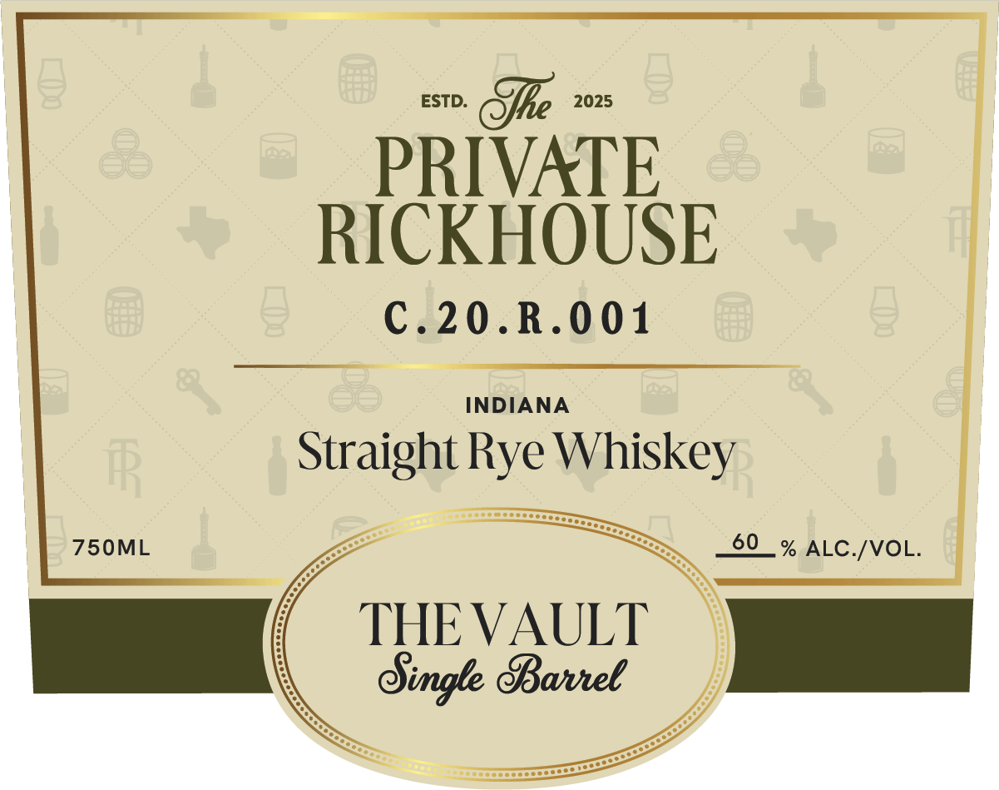
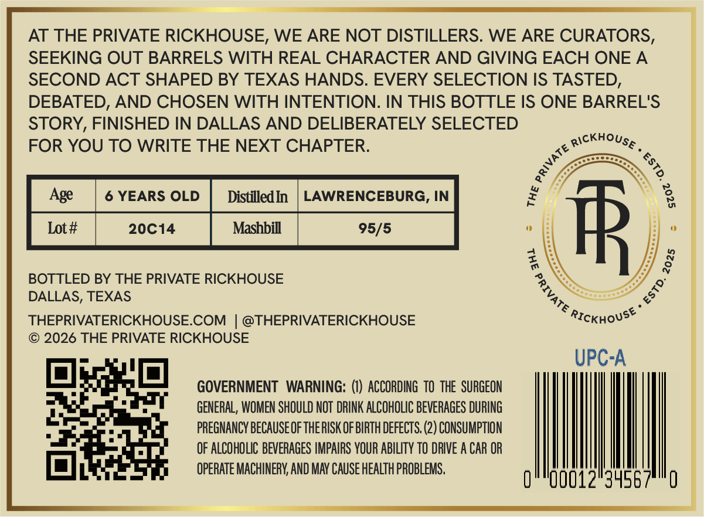

# TTB COLA Label Images - TTBID 26246001000667

**Brand Name:** THE PRIVATE RICKHOUSE

**Fanciful Name:** THE VAULT

**Issue Date:** 09/14/2026

**Origin Code:** 44

**Product Class/Type:** 102

**Source:** [TTB Public COLA Registry](https://ttbonline.gov/colasonline/viewColaDetails.do?action=publicFormDisplay&ttbid=26246001000667)

## Label Images

### Label 1

### Label 2

### Label 3

## Extracted Label Text

*Text extracted via OCR - may contain errors*

*1 image(s) excluded: text did not meet readability threshold*

**Detected Proof:** 120

### Label 1

ESTD:
Sle
2025
PRIVATE
RICKHOUSE
C.20.R.001
INDIANA
FR
Straight Rye
750ML
60
% ALC-/VOL.
THE VAULT
Ofigk BBaveel
Whiskey

### Label 3

AT THE PRIVATE RICKHOUSE, WE ARE NOT DISTILLERS. WE ARE CURATORS,
SEEKING OUT BARRELS WITH REAL CHARACTER AND GIVING EACH ONE A
SECOND ACT SHAPED BY TEXAS HANDS. EVERY SELECTION IS TASTED,
DEBATED, AND CHOSEN WITH INTENTION: IN THIS BOTTLE IS ONE BARREL'S
STORY, FINISHED IN DALLAS AND DELIBERATELY SELECTED
FOR YOU TO WRITE THE NEXT CHAPTER:
Rickhouse
Age
YEARS OLD
DistilledIn
LAWRENCEBURG, IN
Lot#
20C14
Mashbill
95/5
HR
0
BOTTLED BY THE PRIVATE RICKHOUSE
DALLAS, TEXAS
THEPRIVATERICKHOUSECOM
@THEPRIVATERICKHOUSE
RICKHoUse
2026 THE PRIVATE RICKHOUSE
UPC-A
GOVERNMENT   WARNING: () ACCORDING  TO THE   SURGEON
GENERAL, WOMEN SHOULD NOT DRINK ALCOHOLIC BEVERAGES DURING
PREGNANCY BECAUSEOFTHERISK OF BIRTH DEFECTS, (2) CONSUMPTION
OF ALCOHOLIC BEVERAGES IMPAIRS YOUR ABILITY TO DRIVE A CAR OR
OPERATE MACHINERV;, AND MAV CAUSE HEALTh PROBLEMS,
00012"3456
1
3
8
#
8
1
0
