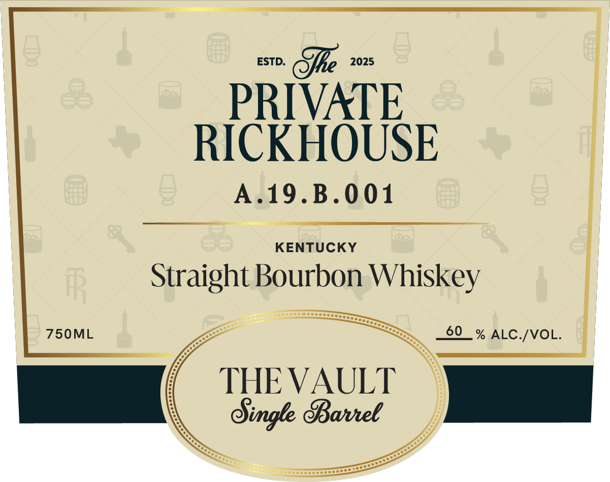
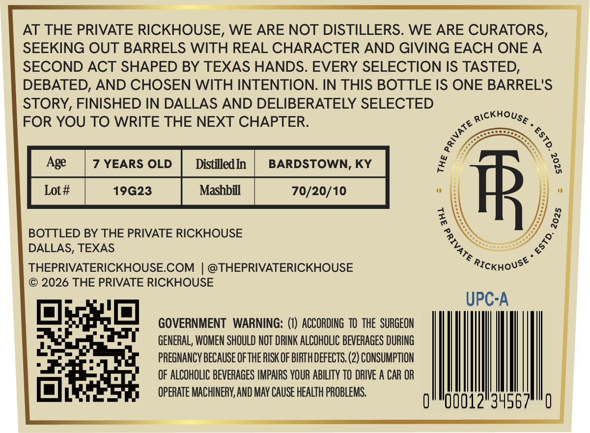

# TTB COLA Label Images - TTBID 26246001000671

**Brand Name:** THE PRIVATE RICKHOUSE

**Fanciful Name:** THE VAULT

**Issue Date:** 09/14/2026

**Origin Code:** 44

**Product Class/Type:** 101

**Source:** [TTB Public COLA Registry](https://ttbonline.gov/colasonline/viewColaDetails.do?action=publicFormDisplay&ttbid=26246001000671)

## Label Images

### Label 1

### Label 2

### Label 3

## Extracted Label Text

*Text extracted via OCR - may contain errors*

*1 image(s) excluded: text did not meet readability threshold*

### Label 1

PRIVATE

RICKHOUSE

ee

A.19.B.001

KENTUCKY

Straight Bourbon Whiskey

750ML

a

—_—,

_60_% ALC./VOL.

THE VAULT

ingle Barrel

|

<>

Sitter

### Label 3

AT THE PRIVATE RICKHOUSE, WE ARE NOT DISTILLERS. WE ARE CURATORS,
SEEKING OUT BARRELS WITH REAL CHARACTER AND GIVING EACH ONE A
SECOND ACT SHAPED BY TEXAS HANDS. EVERY SELECTION IS TASTED,
DEBATED, AND CHOSEN WITH INTENTION: IN THIS BOTTLE IS ONE BARREL'S
STORY, FINISHED IN DALLAS AND DELIBERATELY SELECTED
FOR YOU TO WRITE THE NEXT CHAPTER:
Rickhouse
Age
YEARS OLD
DistilledIn
BARDSTOWN, KY
Lot #
19623
Mashbill
70/20/10
#R
BOTTLED BY THE PRIVATE RICKHOUSE
DALLAS, TEXAS
THEPRIVATERICKHOUSECOM
@THEPRIVATERICKHOUSE
RICKhoUsE
2026 THE PRIVATE RICKHOUSE
UPCA
GOVERNMENT
WARNING:
ACCORDING  T0  thE SURGEON
GENERAL; WOMEN SHOULD NOT DRINK ALCOHOLIC BEVERAGES DURING
PREGNANCY BECAUSE OFTHE RISK OF BIRTHDEFECTS, (2) CONSUMPTION
OF ALCOHOLIC BEVERAGES IMPAIRS YOUR ABILITY TO DRIVE A CAR OR
OPERATE MACHINERY,AND MAY CAUSE HEALTH PROBLEMS,
012"3456
1
3
8
4
1
8
1
0
