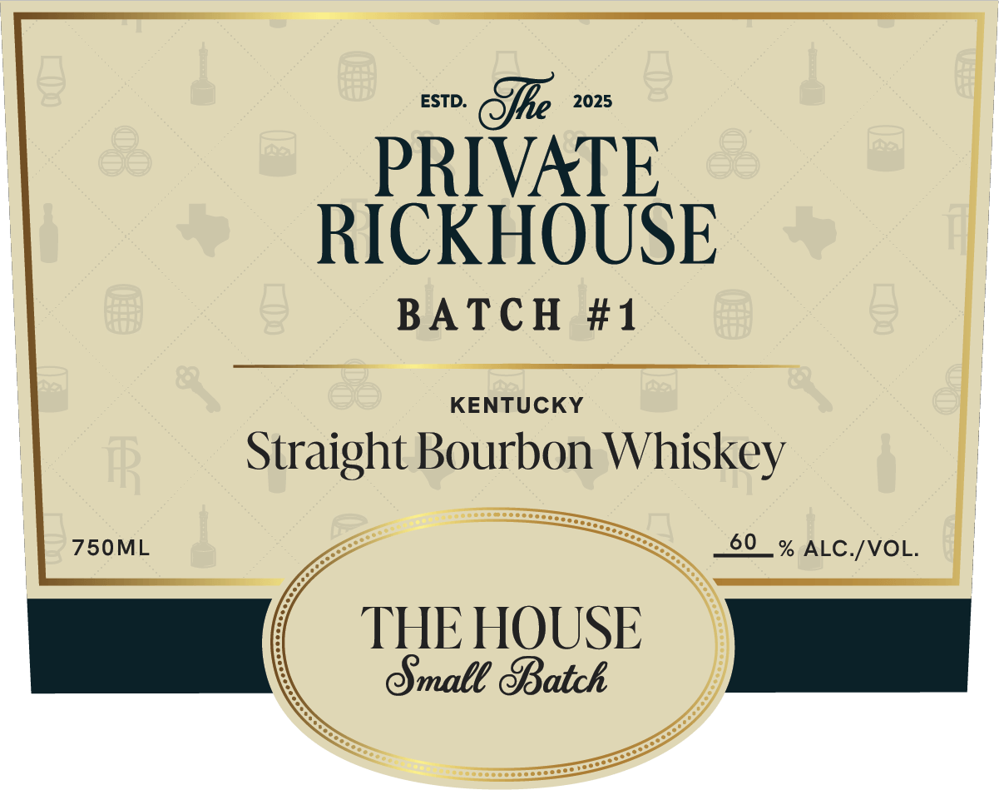
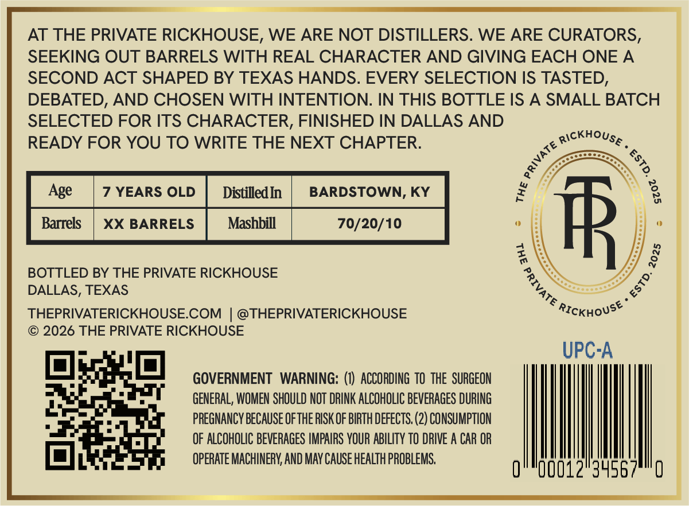

# TTB COLA Label Images - TTBID 26246001000676

**Brand Name:** THE PRIVATE RICKHOUSE

**Fanciful Name:** THE HOUSE

**Issue Date:** 09/14/2026

**Origin Code:** 44

**Product Class/Type:** 101

**Source:** [TTB Public COLA Registry](https://ttbonline.gov/colasonline/viewColaDetails.do?action=publicFormDisplay&ttbid=26246001000676)

## Label Images

### Label 1

### Label 2

### Label 3

## Extracted Label Text

*Text extracted via OCR - may contain errors*

*1 image(s) excluded: text did not meet readability threshold*

**Detected Proof:** 120
**Detected Age:** 7 Years

### Label 1

ESTD:
SBe
2025
PRIVATE
RICKHOUSE
BATCH #1
KENTUCKY
FR
Straight Bourbon Whiskey
750ML
60
% ALC /VOL.
THE HOUSE
Gmale 8Batck

### Label 3

AT THE PRIVATE RICKHOUSE, WE ARE NOT DISTILLERS. WE ARE CURATORS,
SEEKING OUT BARRELS WITH REAL CHARACTER AND GIVING EACH ONE A
SECOND ACT SHAPED BY TEXAS HANDS. EVERY SELECTION IS TASTED,
DEBATED, AND CHOSEN WITH INTENTION. IN THIS BOTTLE IS A SMALL BATCH
SELECTED FOR ITS CHARACTER, FINISHED IN DALLAS AND
READY FOR YOU TO WRITE THE NEXT CHAPTER:
Rickhouse
Age
7 YEARS OLD
DistilledIn
BARDSTOWN, KY
Barrels
XX BARRELS
Mashbill
70/20/10
FR
BOTTLED BY THE PRIVATE RICKHOUSE
DALLAS, TEXAS
THEPRIVATERICKHOUSECOM
@THEPRIVATERICKHOUSE
RIcKHoUsE
2026 THE PRIVATE RICKHOUSE
UPC-A
GOVERNMENT   WARNING: (0)  ACCORDING TO  THE  SURGEON
GENERAL; WOMEN SHOULD NOT DRINK ALCOHOLIC BEVERAGES DURING
PREGNANCY BECAUSE OfTHE RISK OF BIRTH DEFECTS, (2) CONSUMPTION
OF ALCOHOLIC BEVERAGES IMPAIRS YOUR ABILITY TO DRIVE A CAR OR
OPERATE MACHINERV;, AND MaY CAUSE HEaLTh PROBLEMS,
00012
3
1
3
8
#
8
1
1
0
