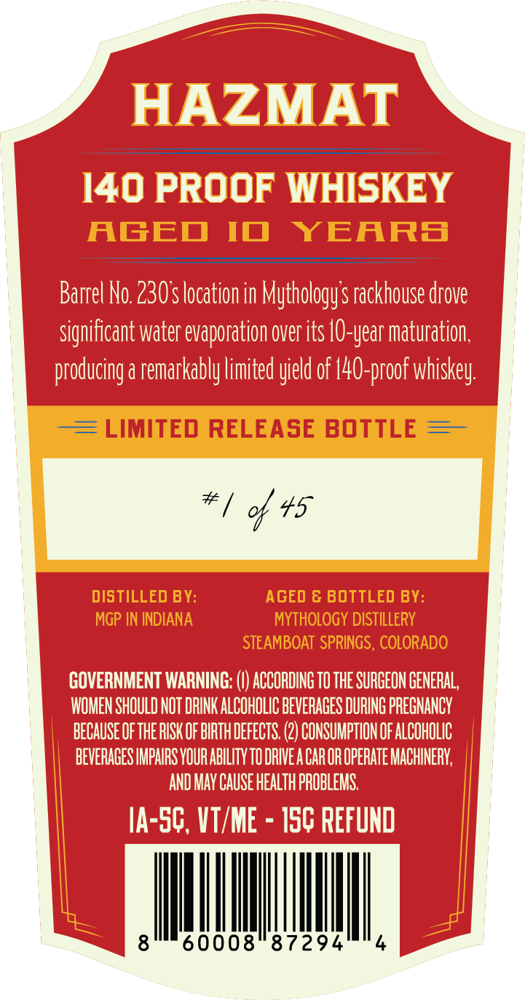
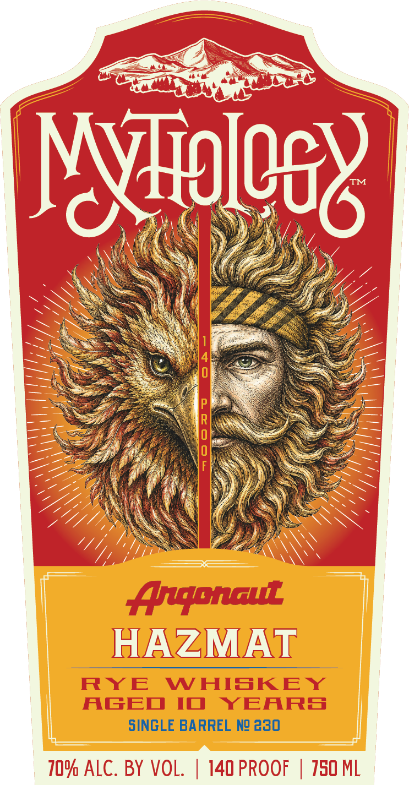

# TTB COLA Label Images - TTBID 26246001000722

**Brand Name:** MYTHOLOGY

**Issue Date:** 09/25/2026

**Origin Code:** 13

**Product Class/Type:** 142

**Source:** [TTB Public COLA Registry](https://ttbonline.gov/colasonline/viewColaDetails.do?action=publicFormDisplay&ttbid=26246001000722)

## Label Images

### Back Label

### Front Label

## Extracted Label Text

*Text extracted via OCR - may contain errors*

**Detected Proof:** 140

### Back Label

HAZMAT
140 PROOF WHISKEY
AGED
I
YEARS
Barrel No 230s location in Mythologys rackhouse drove
Significant Water evaporation over its
'Maturation,
producing a remarkably limited yield of |40-proof whiskey:
LIMITED RELEASE BOTTLE
# / c 45
DISTILLEd BY:
AGED & BOTTLED BY:
MGP IN INDIANA
MYTHOLOGY DISTILLERY
STEAMBOAT SPRINGS , COLORADO
GOVERNMENT WARNING: =
ACCORDING TO THE SURGEON GENERAL,
WOMEN SHOULD NOT DRINK ALCOHOLIC BEVERAGES DURING PREGNANCY
bECauSEOF ThE RISK OF BIRTH DEFECTS, (2) CONSUMPTION OF ALCOHOLIC
BEVERAGES IMPAIRS YOUR ABILITY TO DRIVEA CAR OR OPERATE MACHINERV;
AND MAY CAUSE Health PROBLEMS;
IA-SC, VT/ME
ISC REfUnd
8
60008
87294
; |O-year '

### Front Label

Nyiglee&
o
;
Angpnau
HAZMAT
RYE
WHISKEY
AGED
IO
YEARS
SINGLE BARREL Ng 230
7O% ALC. BY VOL.
140 PROOF
750 ML
