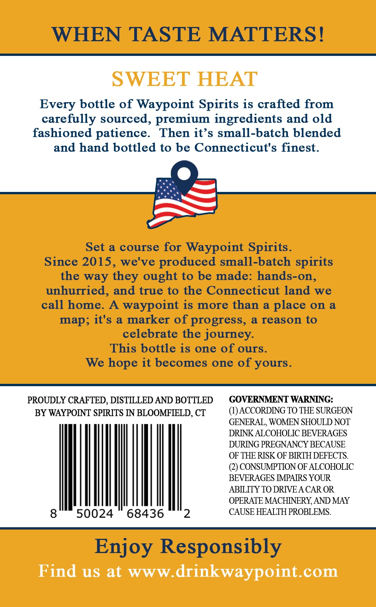
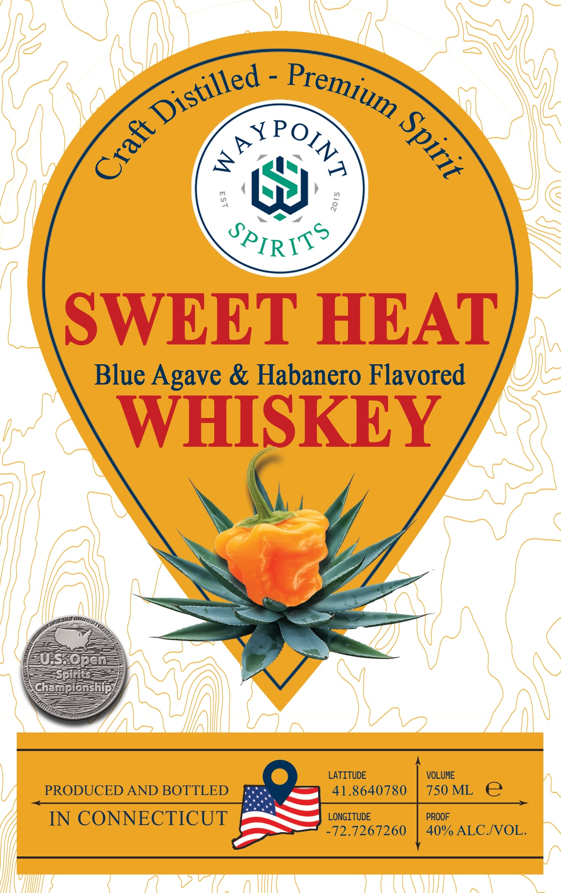

# TTB COLA Label Images - TTBID 26247001000064

**Brand Name:** WAYPOINT SPIRITS

**Fanciful Name:** SWEET HEAT

**Issue Date:** 09/18/2026

**Origin Code:** 14

**Product Class/Type:** 149

**Source:** [TTB Public COLA Registry](https://ttbonline.gov/colasonline/viewColaDetails.do?action=publicFormDisplay&ttbid=26247001000064)

## Label Images

### Back Label

### Front Label

## Extracted Label Text

*Text extracted via OCR - may contain errors*

**Detected Proof:** 80

### Back Label

WHEN TASTE MATTERS !
SWEET HEAT
Every bottle of Waypoint Spirits is crafted from
carefully sourced, premium ingredients and old
fashioned patience.
Then it's small-batch blended
and hand bottled to be Connecticut's finest.
Set a course for
Waypoint Spirits.
Since 2015, we've produced small-batch spirits
the way
ought to be made: hands-on,
unhurried, and true to the Connecticut land
we
call home.
A_
waypoint is more than & place on &
map; it's a marker of progress, & reason to
celebrate the journey
This bottle is one of ours_
We hope it becomes one of yours.
PROUDLY CRAFTED , DISTLLLED AND BOTTLED
GOVERNMENT WARNNNG:
BY WAYPOINT SPRRITS IN BLOOMFIELD, CT
(1) ACCORDNG TO THE SURGEON
GENERAL, WOMEN SHOULD NOT
DRINK ALCOHOLIC BEVERAGES
DURING PREGNANCY BECAUSE
OF THE RISK OF BRTH DEFECTS.
(2) CONSUMPTION OF ALCOHOLIC
BEVERAGES TPARRS YOUR
ABLLITY TO DRIVEA CAR OR
OPERATE MACHINERY AND MAY
8
50024
68436
2
CAUSE HEALTH PROBLEMS:
Enjoy Responsibly
Find us at
WWW:
drinkwaypoint_com
they

### Front Label

Y
4
JPIRITS
SWEET HEAT
Blue Agave & Habanero Flavored
WHISKEY
US_@pen
Spirits
Championship
LATITUDE
VOLUME
PRODUCED AND BOTTLED
41.8640780
750 ML
e
IN CONNECTICUT
LONGITUDE
PROOF
-72.7267260
40% ALC NOL_
Distilled
Premium
1
3
ROIN?
3
