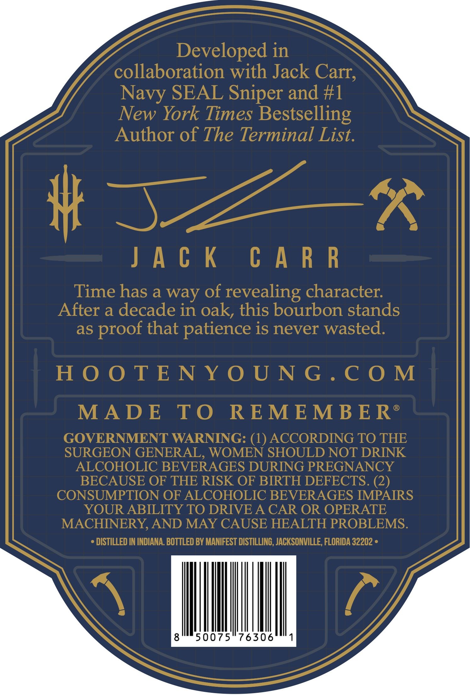
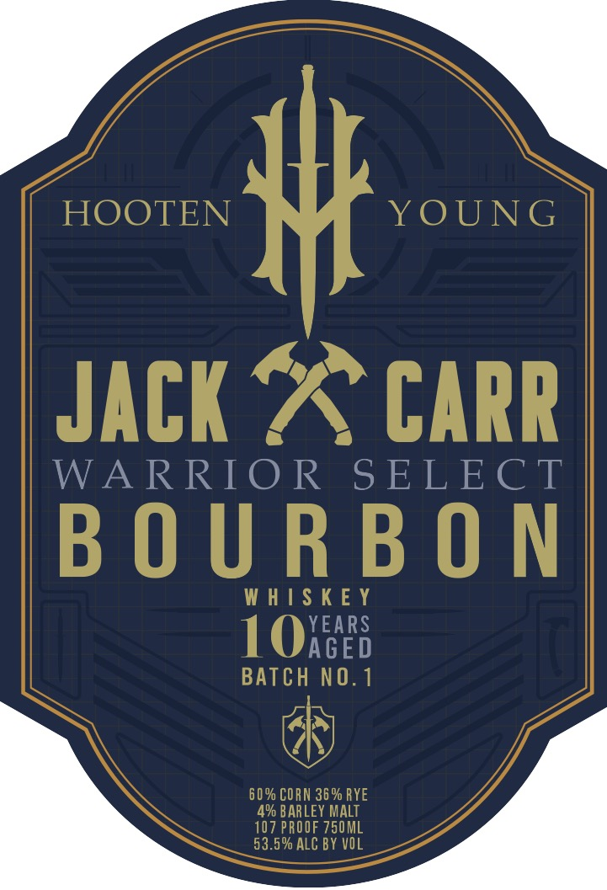

# TTB COLA Label Images - TTBID 26247001000110

**Brand Name:** HOOTEN YOUNG

**Fanciful Name:** JACK CARR

**Issue Date:** 09/14/2026

**Origin Code:** 16

**Product Class/Type:** 141

**Source:** [TTB Public COLA Registry](https://ttbonline.gov/colasonline/viewColaDetails.do?action=publicFormDisplay&ttbid=26247001000110)

## Label Images

### Back Label

### Front Label

## Extracted Label Text

*Text extracted via OCR - may contain errors*

**Detected Proof:** 107

### Back Label

Developed in
collaboration with Jack Carr;
Navy SEAL Sniper and #1
New York Times
Bestselling
Author of The Terminal List.
# ~
4
J A € K
C A R R
Time has a way of
revealing character:
After a decade in oak, this bourbon stands
as
that patience is never wasted:
H 0 0 TE N Y 0 U N G . C 0 M
MADE
T0
REMEMB E R
GOVERNMENT WARNING: (1) ACCORDING TO THE
SURGEON GENERAL, WOMEN SHOULD NOT DRINK
ALCOHOLIC BEVERAGES DURING PREGNANCY
BECAUSE OF THE RISK OF BIRTH DEFECTS. (2)
CONSUMPTION OF ALCOHOLIC BEVERAGES IMPAIRS
YOUR ABILITY TO DRIVE A CAR OR OPERATE
MACHINERY, AND MAY CAUSE HEALTH PROBLEMS.
DISTILLED IN INDIANA. BOTTLED BY MANIFEST DISTILLINC, JACKSONVILLE, FLORIDA 32202 =
8
50075
76306
proof

### Front Label

HOOTEN
##
YOUNG
JAck X CARR
WARRIO R
S ELECT
B 0 U R B 0 N
W H I$ K E Y
1OXEE8
BATCH NO.1
60 % CO RN 36 % RYE
49 BARLEY MALT
107 PROOF 750ML
53.5% ALC BY VOL
