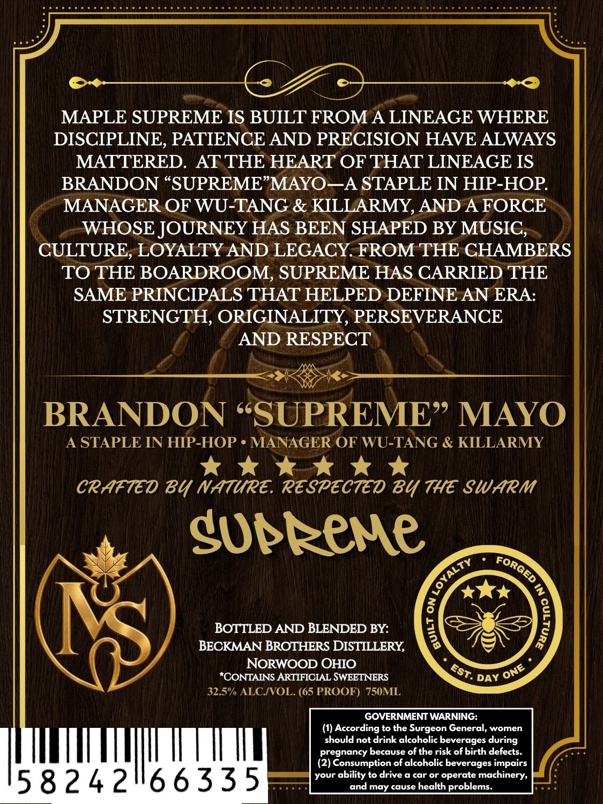
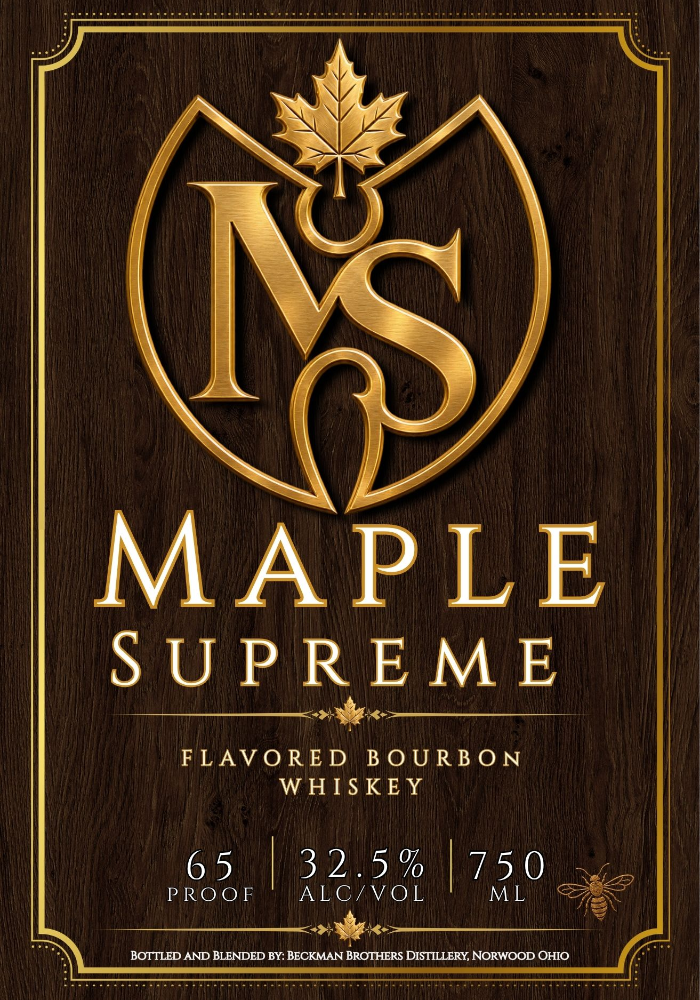

# TTB COLA Label Images - TTBID 26247001000194

**Brand Name:** MAPLE SUPREME

**Issue Date:** 09/14/2026

**Origin Code:** 09

**Product Class/Type:** 149

**Source:** [TTB Public COLA Registry](https://ttbonline.gov/colasonline/viewColaDetails.do?action=publicFormDisplay&ttbid=26247001000194)

## Label Images

### Back Label

### Front Label

## Extracted Label Text

*Text extracted via OCR - may contain errors*

**Detected Proof:** 130

### Back Label

MAPLE SUPREME IS BUILT FROM A LINEAGE WHERE
DISCIPLINE, PATIENCE AND PRECISION HAVE ALWAYS
MATTERED_
ATTHE HEART OF THAT LINEAGE IS
BRANDON "SUPREME"MAYO-A STAPLE IN HIP-HOP
MANAGER OF WU-TANG & KILLARMY, AND A FORCE
WHOSE JOURNEY HAS BEEN SHAPED BY MUSIC,
CULTURE, LOYALTY AND LEGACY FROM THE CHAMBERS
TO THE BOARDROOM, SUPREME HAS CARRIED THE
SAME PRINCIPALS THAT HELPED DEFINE AN ERA:
STRENGTH, ORIGINALITY, PERSEVERANCE
AND RESPECT
BRANDON SSUPREME? MAYO
STAPLE IN HIP-HOP
MANAGER OF WU-TANG & KILLARMY
CRAtted Bu NatuRE. respected B4 the SWarm
Supkeme
4
BOTTLED AND BLENDED BY:
BECKMAN BROTHERS DISTILLERY,
NORWOOD OHIO
"CONTAINS ARTIFICIAL SWEETNERS
DAY
32.5" ALCIVOL: (65 PROOF) 750ML
GOVERNMENT WARNING:
(1) According to the Surgeon General, women
should not drink alcoholic beverages
pregnancy because of the risk of birth defects.
(2) Consumption of alcoholic beverages impairs
15 8242166335
your ability to drive & car or operate machinery;
and may cause health problems:
ForGed
1
EST .
ONE
during

### Front Label

Ai viel bipvalieteteie\ete RelA iet PUMEU SIEM THEE S/UNR bl alacamutatral ofy- ar ulipiaines Mila TAU ate Wie tial oi! i LACE i! ot eee NEM aoa RES he

MAPLE

SUPREME

er

FLAVORED BOURBON

WHISKEY

Ws

PROOF

615 iB 2 O17,

ALG/,VOL

| 750

RS

(a mcr rr |

ty

1:

.

BOTTLED AND BLENDED BY: BECKMAN BROTHERS DISTILLERY, NORWOOD OHIO
