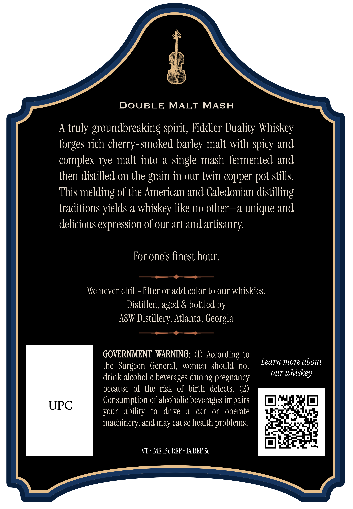
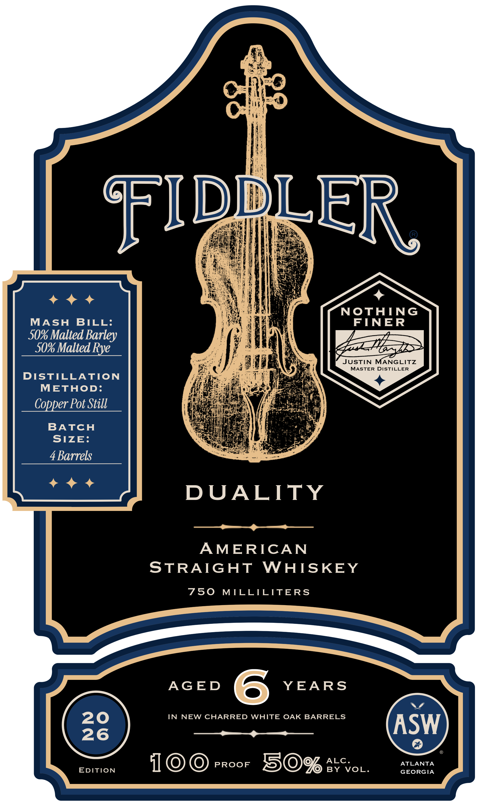

# TTB COLA Label Images - TTBID 26247001000199

**Brand Name:** FIDDLER

**Fanciful Name:** DUALITY

**Issue Date:** 10/02/2026

**Origin Code:** 08

**Product Class/Type:** 109

**Source:** [TTB Public COLA Registry](https://ttbonline.gov/colasonline/viewColaDetails.do?action=publicFormDisplay&ttbid=26247001000199)

## Label Images

### Back Label

### Front Label

## Extracted Label Text

*Text extracted via OCR - may contain errors*

**Detected Proof:** 100
**Detected Age:** 6 Years

### Back Label

DOUBLE
MALT
MASH
A
truly groundbreaking spirit; Fiddler Duality Whiskey
forges rich cherry-smoked barley malt with spicy and
complex rye malt into
a
Single mash  fermented and
then distilled on the grain in our twin copper
stills.
This melding of the American and Caledonian distilling
traditions
a
whiskey like no other--a unique and
delicious expression of our art and artisanry:
For one's finest hour:
We never chill-filter or add color to our whiskies.
Distilled, aged & bottled by
ASW Distillery, Atlanta, Georgia
GOVERNMENT WARNING:
According to
Learn more about
the   Surgeon  General,
women   should not
drink alcoholic beverages during pregnancy
OUr
whiskey
because  of the risk of birth   defects.
(2_
Consumption of alcoholic beverages impairs
UPC
your   ability
to
drive
a
car
OT   operate
machinery,and may cause health problems
bitly
VT
ME 15c REF
TA REF 5c
pot
yields

### Front Label

FIDDLER
NOTHING
MASH
BILL:
FINER
50% Malted Barley
50% Malted Rye
JUSTIN
MANGLITZ
MASTER DISTILLER
DISTILLATION
METHOD:
Copper Pot Still
BATCH
SIZE:
4 Barrels
DUALITY
AMERICAN
STRAIGHT
WHISKEY
750
MILLILITERS
AGED
6
YEARS
20
IN
NEW CHARRED WHITE OAK BARRELS
26
ASW
PROOF
50%
ALC _
ATLANTA
EDITION
BY
VOL.
GEORGIA
