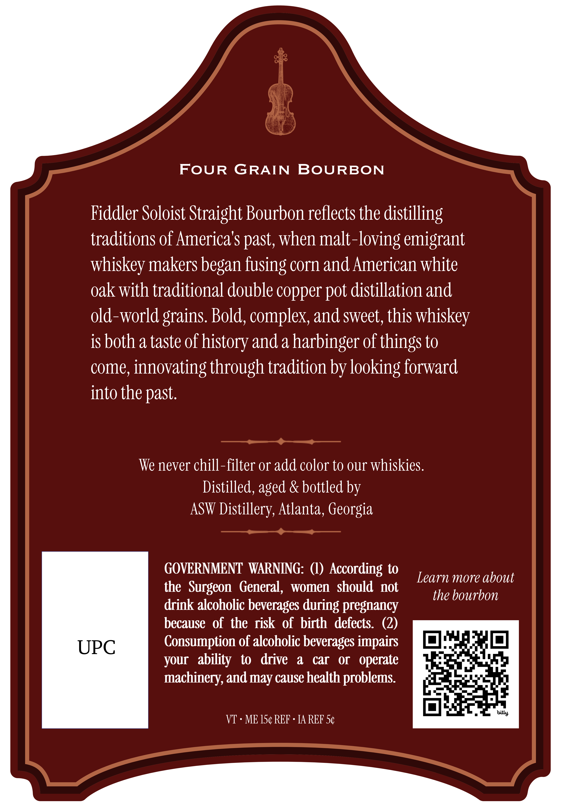
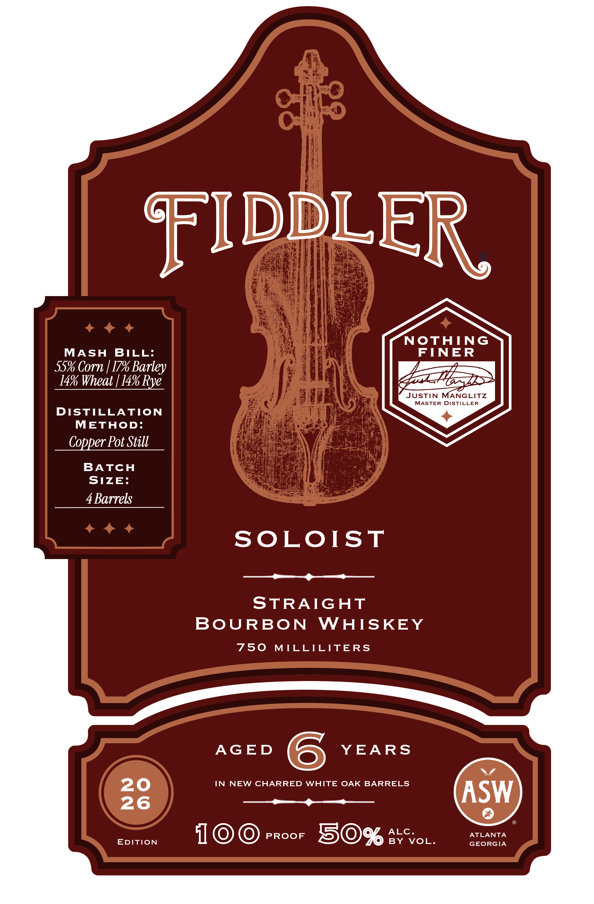

# TTB COLA Label Images - TTBID 26247001000202

**Brand Name:** FIDDLER

**Fanciful Name:** SOLOIST

**Issue Date:** 09/11/2026

**Origin Code:** 08

**Product Class/Type:** 101

**Source:** [TTB Public COLA Registry](https://ttbonline.gov/colasonline/viewColaDetails.do?action=publicFormDisplay&ttbid=26247001000202)

## Label Images

### Back Label

### Front Label

## Extracted Label Text

*Text extracted via OCR - may contain errors*

**Detected Proof:** 100
**Detected Age:** 6 Years

### Back Label

FoUR
GRAIN
BOURBON
Fiddler Soloist Straight Bourbon reflects the distilling
traditions of America'$ past, when malt-loving emigrant
whiskey makers began fusing corn and American white
oak with traditional double copper
distillation and
old-world grains Bold, complex; and sweet; this whiskey
is both a taste of history and a harbinger of things to
come, innovating through tradition by looking forward
into the past.
We never chill-filter or add color to our whiskies
Distilled, aged & bottled by
ASW Distillery, Atlanta, Georgia
GOVERNMENT WARNING:
According to
Learn more about
the  Surgeon   General,
women  should not
the bourbon
drink alcoholic beverages during pregnancy
because   of the risk of birth   defects:
(2)
UPC
Consumption of alcoholic beverages impairs
your   ability   to
drive
a
car
OI
operate
machinery, and may cause health problems
bitly
VT
ME 154 REF
IA REF 5c
pot

### Front Label

FIDDLER
NOTHING
MASH
BILL:
FTNER
55% Corn | 179 Barley
14% Wheat [ 14% Rye_
JUSTIN
MANGLITZ
MASTER DISTILLER
DISTILLATION
METHOD:
Copper Pot Still
BATCH
SIZE:
4 Barrels
SOLOIST
STRAIGHT
BoURBON
WHISKEY
750
MTLLILITERS
AGED
6
YEARS
20
IN
NEW CHARRED
WHITE OAK BARRELS
26
ASW
EDITION
10
PROOF
50%
RYCV
VOL.
ATLANTA
GEORGIA
