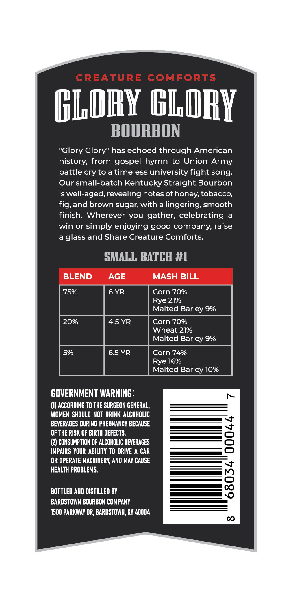
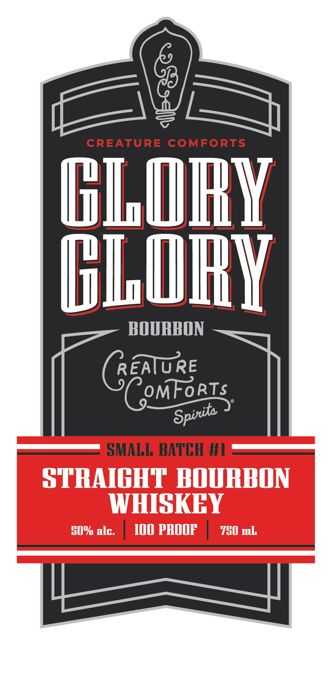

# TTB COLA Label Images - TTBID 26247001000243

**Brand Name:** CREATURE COMFORTS SPIRITS

**Fanciful Name:** GLORY, GLORY BOURBON

**Issue Date:** 09/11/2026

**Origin Code:** 08

**Product Class/Type:** 101

**Source:** [TTB Public COLA Registry](https://ttbonline.gov/colasonline/viewColaDetails.do?action=publicFormDisplay&ttbid=26247001000243)

## Label Images

### Back Label

### Front Label

## Extracted Label Text

*Text extracted via OCR - may contain errors*

**Detected Proof:** 150
**Detected Age:** 6 Years

### Back Label

CREATURE
COMFORTS
GLORY GLURY
BOURBON
"Glory Glory" has echoed through American
history; from gospel hymn to Union Army
battle cry to a timeless university fight song_
Our small-batch Kentucky Straight Bourbon
is well-aged, revealing notes ofhoney, tobacco,
fig, and brown sugar; with a lingering, smooth
finish: Wherever you gather, celebrating
a
win or simply enjoying good company, raise
a
glass and Share Creature Comforts:
SMALL BATCH #I
BLEND
AGE
MASH BILL
75%
6 YR
Corn 70%
Rye 21%
Malted Barley 9%
20%
4.5 YR
Corn 70%
Wheat 21%
Malted Barley 9%
5%
6.5 YR
Corn 74%
Rye 16%
Malted Barley 10%
COVERNMENT WARNING:
(1) ACCORDING TO THE SURGEON GENERAL,
WOMEN SHOULD NOT DRINK ALCOHOLIC
BEVERACES DURINC PRECNANCY BECAUSE
OF THE RISK OF BIRTH DEFECTS.
8
(2) CONSUMPTION OF ALCOHOLIC BEVERACES
IMPAIRS  YOUR ABILITY TO DRIVE A CAR
OR OPERATE MACHINERY; AND MAY CAUSE
HEALTH PROBLEMS:
BOTTLED AND DISTILLED BY
8
BARDSTOWN BOURBON COMPANY
1500 PARKWAY DR, BARDSTOWN; KY 4OOOL
0

### Front Label

CREATURE
COMFORTS
HIORY
ELUHY
HOURBON
Genture
CemForts
SMALL BATCH #L
STRAIGHT HOURPON
WHISKHY
50% alc.
I0O pROOF
7G0 mL
Spirta
