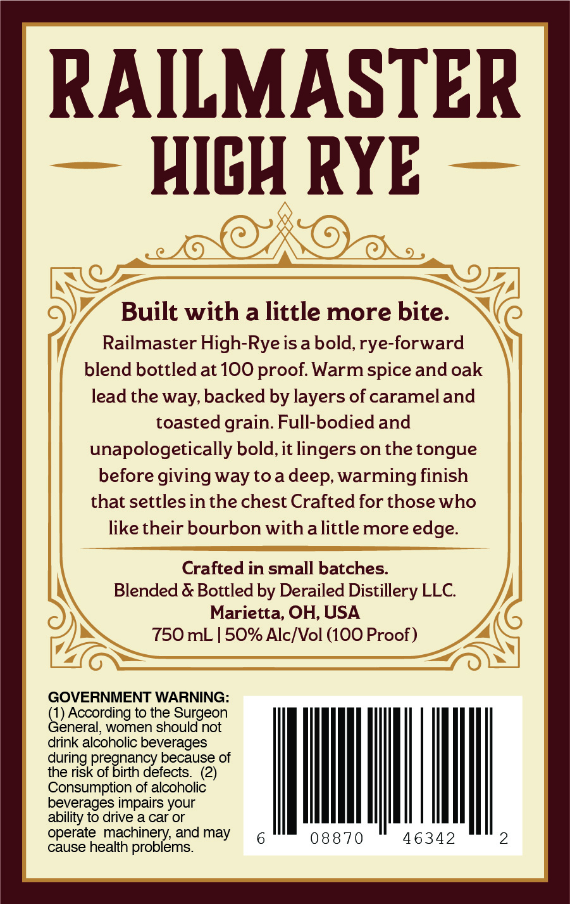
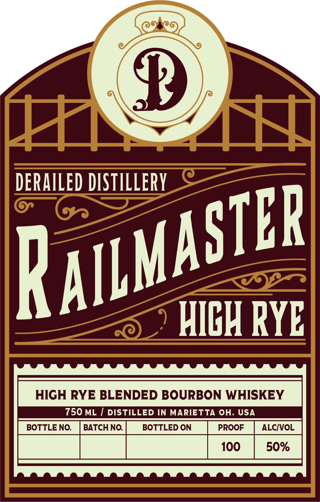
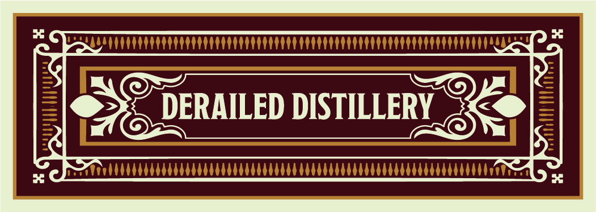
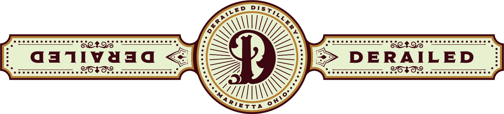

# TTB COLA Label Images - TTBID 26247001000299

**Brand Name:** DERAILED DISTILLERY

**Fanciful Name:** RAILMASTER HIGH-RYE

**Issue Date:** 09/11/2026

**Origin Code:** 09

**Product Class/Type:** 131

**Source:** [TTB Public COLA Registry](https://ttbonline.gov/colasonline/viewColaDetails.do?action=publicFormDisplay&ttbid=26247001000299)

## Label Images

### Back Label

### Front Label

### Label 3

### Label 4

## Extracted Label Text

*Text extracted via OCR - may contain errors*

**Detected Proof:** 100

### Back Label

RAILMASTER
HICH RYE
Built with a little more bite.
Railmaster High-Rye is a bold,rye-forward
blend bottledat 100 proof: Warm spice and oak
lead the way, backed by layers of carameland
toasted grain  Full-bodied and
unapologetically bold,it lingers on the tongue
before giving way toa
warming finish
that settlesin the chest Crafted for those who
like their bourbon with alittle more edge:
Crafted in small batches:
Blended & Bottled by Derailed Distillery LLC
Marietta, OH, USA
750 mL
50% Alc/Vol (1OO Proof _
GOVERNMENT WARNING:
(1) According to the Surgeon
General, women should not
drink alcoholic beverages
during pregnancy because of
the risk of birth defects  (2)
Consumption of alcoholic
beverages impairs your
ability to drive a car or
operate machinery; and may
088 70
46342
2
cause health problems
deep;"

### Front Label

CE
DERAILED DISiiLLERY
HICH RYE
HIGH RYE BLENDED BOURBON WHISKEY
750 ML
DISTILLED IN MARIETTA OH. USA
BOTTLE NO:
BATCH NO.
BOTTLED ON
PROOF
ALCIVOL
100
50%
RaILMaSiEr

### Label 3

ee PRUE TTTTTTTTTTITTTTTTITTTTTTITTTTTT CT TTTTITTTT TTI TTTTTTT TTT GEST ery
i © 45 DERAILED DISTILLERY. -X@ d
bog) Sa MMM Ra

### Label 4

cen

3

S

\\

UI)

Vy

Pocccccccccccccces

weccccccvcccccce

=

Up

weccccccccccccce

eocccccccccccccce

qativaad <

=> DERAILED

eve ceeoecvceevcee

DOeee eer errr rr)

LZ,

—

ecco ecececvccce

ee ccc eee ceeeece

ZHI\\\WS

II\

Oro °
