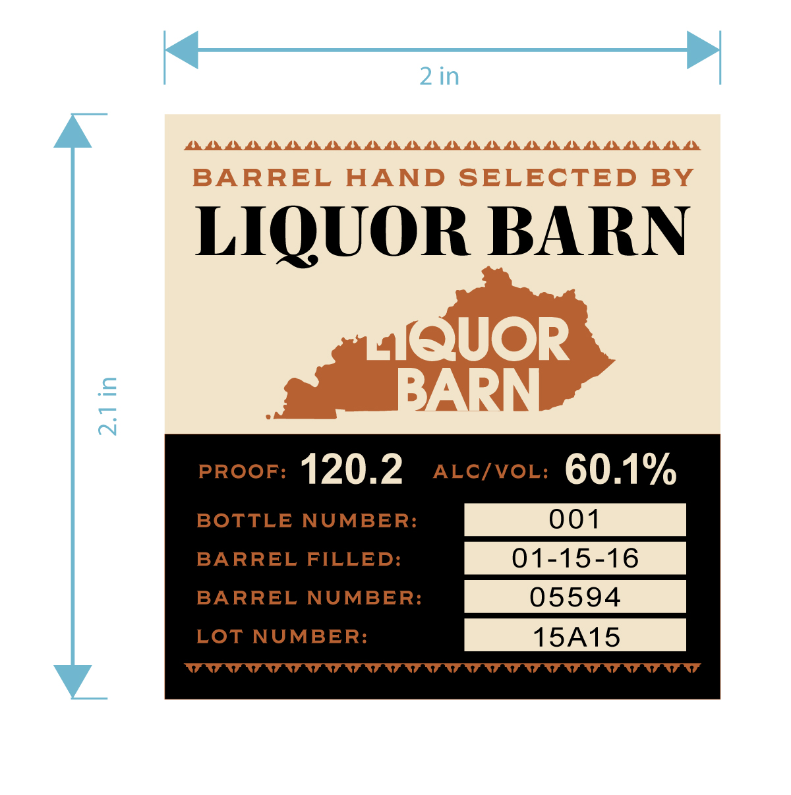
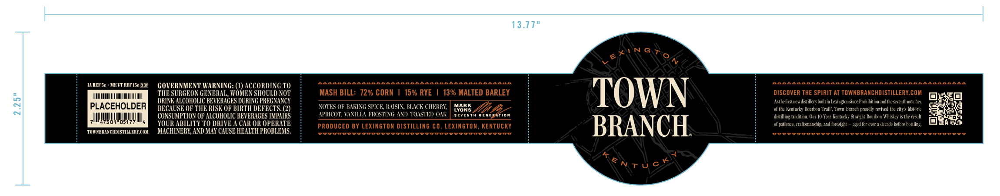
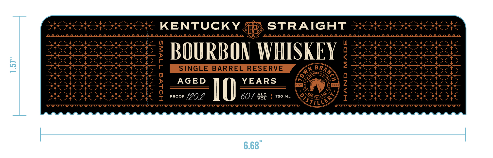
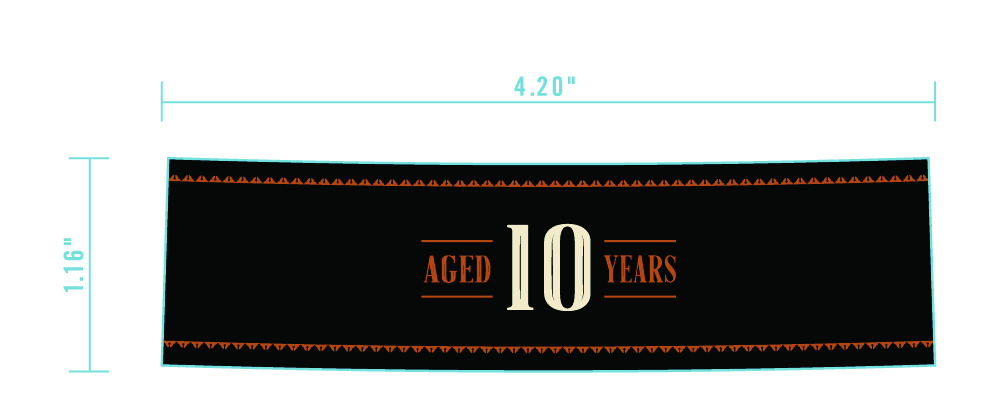

# TTB COLA Label Images - TTBID 26247001000443

**Brand Name:** TOWN BRANCH 10YR

**Fanciful Name:** SINGLE BARREL RESERVE BOURBON WHISKEY CASK STRENGTH (BARREL SELECTION)

**Issue Date:** 09/11/2026

**Origin Code:** 22

**Product Class/Type:** 101

**Source:** [TTB Public COLA Registry](https://ttbonline.gov/colasonline/viewColaDetails.do?action=publicFormDisplay&ttbid=26247001000443)

## Label Images

### Back Label

### Label 1

### Label 2

### Label 4

## Extracted Label Text

*Text extracted via OCR - may contain errors*

*1 image(s) excluded: text did not meet readability threshold*

**Detected Proof:** 120.2

### Back Label

2 in
ALALALALALALALALALALALALALALAU
LALALAAL
BARREL
HAND SELECTED
BY
LIQUOR BARN
AQUOR
9
BARN
PROOF:
120.2
ALCIVOL:
60.1%
BOTTLE NUMBER:
001
BARREL FILLED:
01-15-16
BARREL NUMBER:
05594
LOT NUMBER:
15A15

### Label 1

13.77"
67'NG70
LANAAAAAAAAAA
LALALAAAAALAAALAAALA
LAAAAAAAAAAAAAAAAAAAAAAAAAAAAAAAAAAAAAAALAA
M REF 5c
HEWT REF I5c pF
GOVERNMENT WARNING: (1) ACCORDING TO
II
TIIE SURGEON GENERAL, WOMEN SHOULD VOT
MASH BILL: 72% CORN
15% RYE
13% MALTED BARLEY
TOWN
DISCOVER THE SPIRIT AT TOWNBRANCHDISTILLERY COM
DRINK ALCOHOLIC BEVERAGES DURING PREGVANCY
Astkefiratnen di tiller} buillin Lexin_tonsinceProhibitian anuthezeenth member
3
PLACEHOLDER
BECAUSE OF THE RISK OF BIRTH DEFECTS
NOTES OF KIKTNG SPICE RUSIN , BLICK CHERRI,
LYORS
of Ihe Rentuck , Bourbon Trail , Toxn Branch prouul revixee the citys histurie
CONSLMPTION OF ALCOHOLIC BEVERIGES IMPAIRS
APRICOT ELVLLA FROSTTNG AWD TOISTED) Ou
EvEhTh
Generation
distilling tradition . Our I0-Icar Kentucky Straight Kourn Whidkey
the Fesult
47301
05177
YOUR ABILITY TO DRIVE A CAR OR OPERATE
PRODUCED BY LEXINGTON DISTILLING CO. LEXINGTON, KENTUCKY
BRANCH
of paliecre; (Taltsmanshipand furesizht
aged fr MiT
dcade hefore hottling
TOUNBRLNC HDISTILLERK COM
MACHIVERE, AND MAY CAUSE HEALTH PROBLEMS:
T tnt
It
TentJcx

### Label 2

Mea a Va aa at Vee paw he ht de PS PR OS Pe
PHOT KENTUCKY Zs STRAIGHT serene
AAARAR ALARA ALAR ARAL AR ARAL ALAR ALARA ARAL AMAA AR ARAL ARAL AR AAR AAR ALARA ARAL AR ALARA ISTE ARARARARAR ARAL ALAR ALAR ALAR ALAR ALAR AR ARAL UR ALAR ALAR AR ARAL ARAL ARE AA AR A Ae A
BN Sd Ut) Se SS ee ee
A PIAUZS PTS SIAVTAP IONE BOURBON WHIS I q SEARS Pat BIA FIS BESS
4 PHS ees 2 (SS APES EEE Oe
5 Stes asear ihe? £ poe BS ete
al: rece tectict tor thects SINGLE BARREL RESERVE far BRAY Lpebh ab 46.46.6848
Se ee ee eS! SSRN Q OO Oe
ST SSTS CIS CIS CISetSeesS > OUAGED YEARS [Kees \ FOSS SSS
Dat OA A a Oat Va Ve foa:( | amd Z Sec See Sac See See See See
Stsetectietictc ty 4 ~~ _ kak Jel q Ptuctue tus tartar tacrt.
Nt Nee Nec Sec Secs 0 c ; Vo 6/8] DY Fin, Se, Fai, Fae Se, Fe, Se
Stee hee tre tees OT Or 02 6O/ wor | 750M tay I eR ORR
nN rrr rrr rrr err rrerrrrerewr SOILS gore prr wre wre wwrer ewes
|
|
aor
6.68
