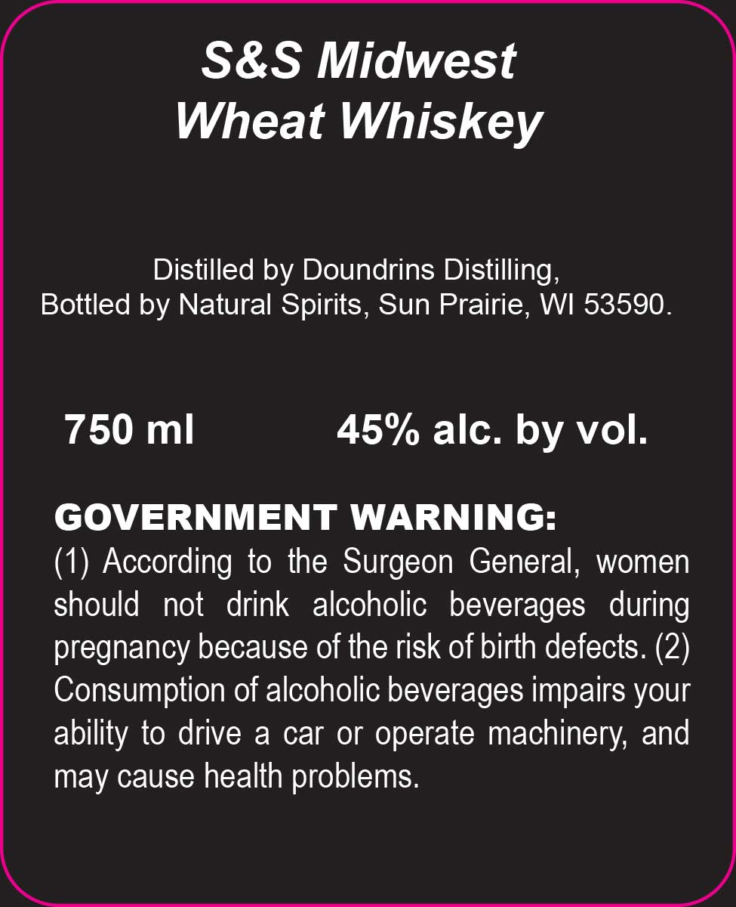
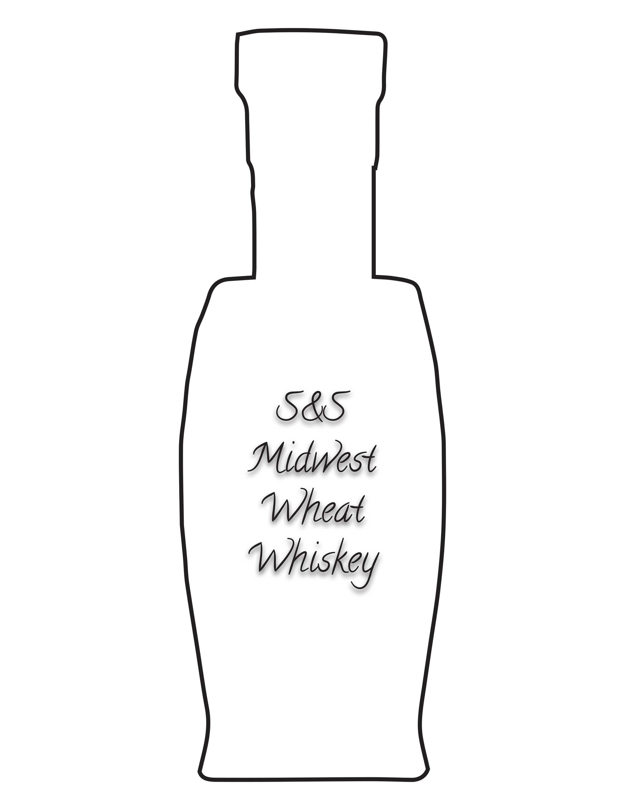

# TTB COLA Label Images - TTBID 26247001000446

**Brand Name:** NATURAL SPIRITS

**Fanciful Name:** S&S MIDWEST WHEAT WHISKEY

**Issue Date:** 09/11/2026

**Origin Code:** 48

**Product Class/Type:** 140

**Source:** [TTB Public COLA Registry](https://ttbonline.gov/colasonline/viewColaDetails.do?action=publicFormDisplay&ttbid=26247001000446)

## Label Images

### Label 1

### Label 2

## Extracted Label Text

*Text extracted via OCR - may contain errors*

*1 image(s) excluded: text did not meet readability threshold*

**Detected Proof:** 90

### Label 1

S&S Midwest

Wheat Whiskey

Distilled by Doundrins Distilling,

Bottled by Natural Spirits, Sun Prairie, WI 53590.

750 ml

45% alc. by vol.

GOVERNMENT WARNING:

(1) According to the Surgeon General, women

should not drink alcoholic beverages during

pregnancy because of the risk of birth defects. (2)

Consumption of alcoholic beverages impairs your

ability to drive a car or operate machinery, and

may cause health problems.
