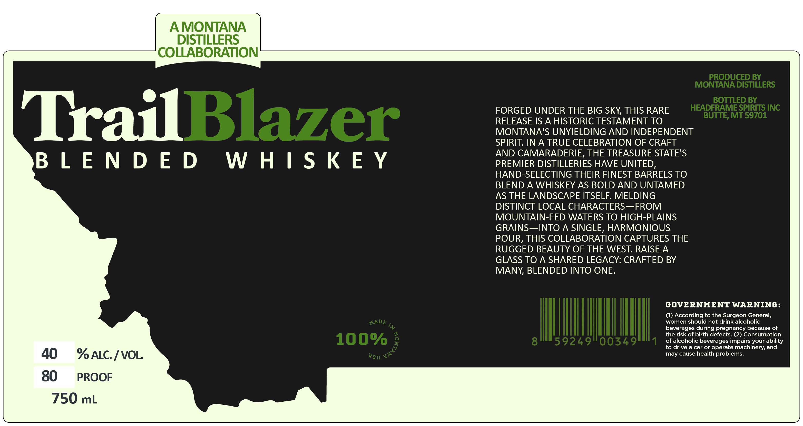

# TTB COLA Label Images - TTBID 26247001000547

**Brand Name:** A MONTANA DISTILLERS COLLABORATION

**Fanciful Name:** TRAILBLAZER BLENDED WHISKEY

**Issue Date:** 10/02/2026

**Origin Code:** 30

**Product Class/Type:** 137

**Source:** [TTB Public COLA Registry](https://ttbonline.gov/colasonline/viewColaDetails.do?action=publicFormDisplay&ttbid=26247001000547)

## Label Images

### Label 1

## Extracted Label Text

*Text extracted via OCR - may contain errors*

**Detected Proof:** 80

### Label 1

AMONTANA
DISTILLERS
COLLABORATION
PRODUCED BY
MONTANA DISTILLERS
BOTTLED BY
FORGED UNDER THE BIG SKY, THIS RARE
HEADFRAME SPIRITS INC
TrailBlazer
RELEASE IS A HISTORIC TESTAMENT TO
BUTTE, MT 59701
MONTANA'S UNYIELDING AND INDEPENDENT
SPIRIT: IN A TRUE CELEBRATION OF CRAFT
AND CAMARADERIE, THE TREASURE STATE'S
B
L E N D E D
W H | $ K E Y
PREMIER DISTILLERIES HAVE UNITED
HAND-SELECTING THEIR FINEST BARRELS TO
BLEND A WHISKEY AS BOLD AND UNTAMED
AS THE LANDSCAPE ITSELF: MELDING
DISTINCT LOCAL CHARACTERS
FROM
MOUNTAIN-FED WATERS TO HIGH-PLAINS
GRAINS
INTO A SINGLE, HARMONIOUS
POUR, THIS COLLABORATION CAPTURES THE
RUGGED BEAUTY OF THE WEST. RAISE A
GLASS TO A SHARED LEGACY: CRAFTED BY
MANY, BLENDED INTO ONE.
GOVERNMENT WARNING:
(1) According to the Surgeon General;
KADE
women should not drink alcoholic
I1
beverages during pregnancy because of
the risk of birth defects
(2) Consumption
100%
8
592491/00349
of alcoholic beverages impairs your ability
to drive a car or operate machinery; and
40
% ALC / VOL
may cause health problems
80
PROOF
750 mL
VNVS'
vsn
