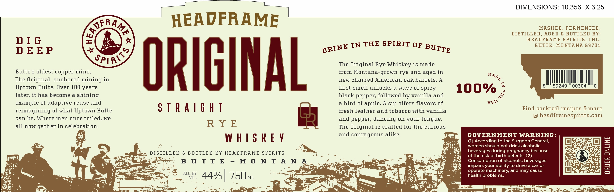

# TTB COLA Label Images - TTBID 26247001000550

**Brand Name:** HEADFRAME SPIRITS

**Fanciful Name:** ORIGINAL STRAIGHT RYE WHISKEY

**Issue Date:** 09/16/2026

**Origin Code:** 30

**Product Class/Type:** 102

**Source:** [TTB Public COLA Registry](https://ttbonline.gov/colasonline/viewColaDetails.do?action=publicFormDisplay&ttbid=26247001000550)

## Label Images

### Label 1

## Extracted Label Text

*Text extracted via OCR - may contain errors*

### Label 1

DIMENSIONS: 10.356” X 3.25”

——

_

Cys

H

EADFRA

ME

MASHED, FERMENTED,

an

DISTILLED, AGED & BOTTLED BY:

DIG

HEADFRAME SPIRITS, INC.

BUTTE, MONTANA 59701

DEEP

Nk IN THE SPIRIT OF pyp

SP]

“

The Original Rye Whiskey is made

Butte’s oldest copper mine,

from Montana-grown rye and aged in

The Original, anchored mining in

new charred American oak barrels. A

MAD

ANI

Uptown Butte. Over 100 years

ORIGINAL *

first smell unlocks a wave of spicy

later, it has become a shining

black pepper, followed by vanilla and

100% ;

example of adaptive reuse and

a hint of apple. A sip offers flavors of

vs®

STRAIGHT

fresh leather and tobacco with vanilla

Find cocktail recipes & more

reimagining of what Uptown Butte

can be. Where men once toiled, we

and pepper, dancing on your tongue.

@ headframespirits.com

RYE

all now gather in celebration.

The Original is crafted for the curious

and courageous alike.

GOVERNMENT WARNING:

WHISKEY

Lia od |

tS

women should not drink alcoholic

(1) According to the Surgeon General,

e

KIN

Et,

~

+o

S

Ms

“2%

of the risk of birth defects. (2)

beverages during pregnancy because

{ boon)

DISTILLED & BOTTLED BY HEADFRAME SPIRITS

Nt

os

m4

=

ats

Consumption of alcoholic beverages

Cy

ae

aa

jar chee

Eales BUTTE~MONTANA

Ny

Bay

impairs your ability to drive a car or

elo3

Be

if

NA

oo

ALC BY

~ ol ore

mis

reg

1

operate machinery, and may cause

cots

Qa ,

~

th

je

health problems.

B

ve

v

“et

v=, Vol

psy

sre

Le

ie

Ee 8. =<r.fietkKe _ _

oe

24%

[oUr

Pa. oe

oa

=

U

=

Pal ee

—,
