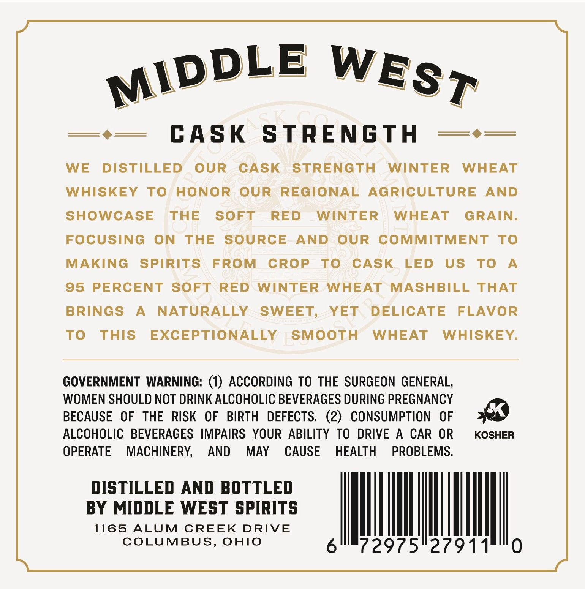
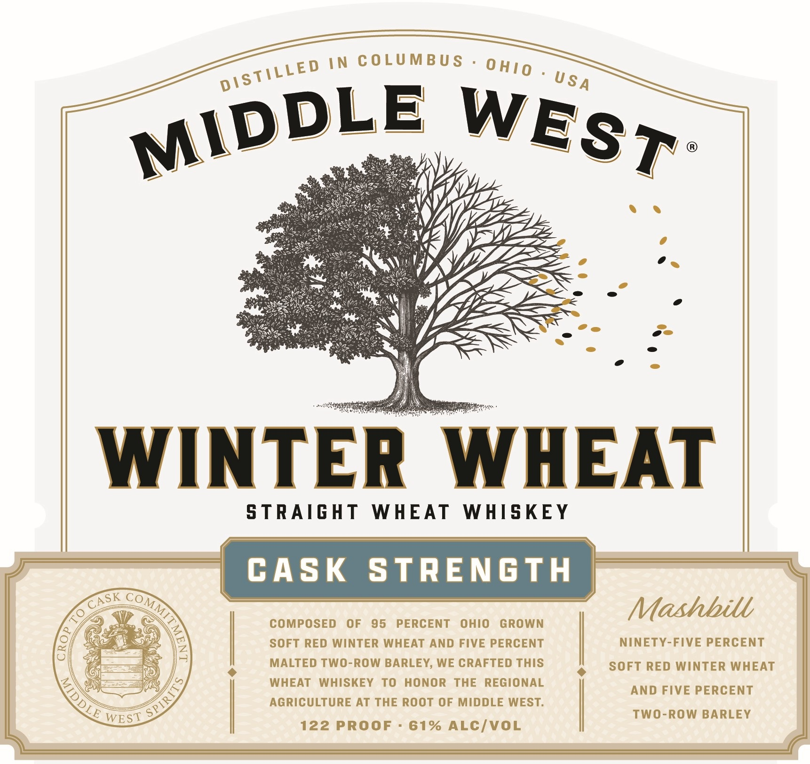

# TTB COLA Label Images - TTBID 26249001000018

**Brand Name:** MIDDLE WEST

**Issue Date:** 09/11/2026

**Origin Code:** 09

**Product Class/Type:** 109

**Source:** [TTB Public COLA Registry](https://ttbonline.gov/colasonline/viewColaDetails.do?action=publicFormDisplay&ttbid=26249001000018)

## Label Images

### Back Label

### Front Label

### Label 3

## Extracted Label Text

*Text extracted via OCR - may contain errors*

*1 image(s) excluded: text did not meet readability threshold*

**Detected Proof:** 122

### Back Label

CASK
STRENGTH
WE
DISTILLED
OUR
CASK
STRENGTH
WINTER
WHEAT
WHISKEY
To
HONOR
OUR
REGIONAL
AGRICULTURE
AND
SHOWCASE
THE
SOFT
RED
WINTER
WHEAT
GRAIN:
FOCUSING
ON
THE
SOURCE
AND
OUR
COMMITMENT
To
MAKING
SPIRITS
FROM
CROP
To
CASK
LED
US
To
A
95
PERCENT
SOFT
RED
WINTER
WHEAT
MASHBILL
THAT
BRINGS
A
NATURALLY
SWEET,
YET
DELICATE
FLAVOR
To
THIS
EXCEPTIONALLY
SMOOTH
WHEAT
WHISKEY
GOVERNMENT
WARNING: (1) ACCORDING TO THE SURGEON GENERAL,
WOMEN SHOULD NOT DRINK ALCOHOLIC BEVERAGES DURING PREGNANCY
BECAUSE
OF
THE
RISK   OF
BIRTH
DEFECTS.  (2)
CONSUMPTION
OF
ALCOHOLIC   BEVERAGES IMPAIRS YOUR ABILITY TO DRIVE
A
CAR
OR
KOSHER
OPERATE
MACHINERY;
AND
MAY
CAUSE
HEALTH
PROBLEMS.
DISTILLED AND BOTTLED
BY MIDDLE WEST SPIRITS
1165
ALUM
CREEK
DRIVE
COLUMBUS,
OHIO
72975"27911
MIDDLE
WEST

### Front Label

IN COLUMBU S
WINTER
WHEAT
S TRAIGHT
WHEAT
WHISKEY
CASK
StrEnGTH
Mashbill
COMPOSED
OF
95
PERCENT
OHIO
GROWN
SOFT RED WINTER WHEAT AND FIVE PERCENT
NINETY-FIVE PERCENT
MALTED TWO-ROW BARLEY, WE CRAFTED THIS
SOFT RED WINTER WHEAT
WHEAT
WHISKEY
To
HONOR
THE REGIONAL
AND FIVE PERCENT
0
AGRICULTURE AT THE Root OF MIDDLE WEST.
LE WEST
TwO-ROW BARLEY
122 PROOF
61% ALCIVOL
0 HIO
DISTILLED
U $ A
MIDDLE
WEST
CASK
COMM
6
0
