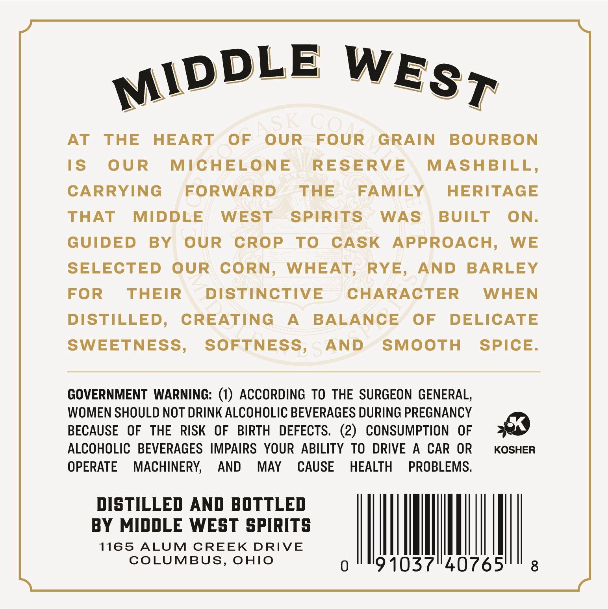
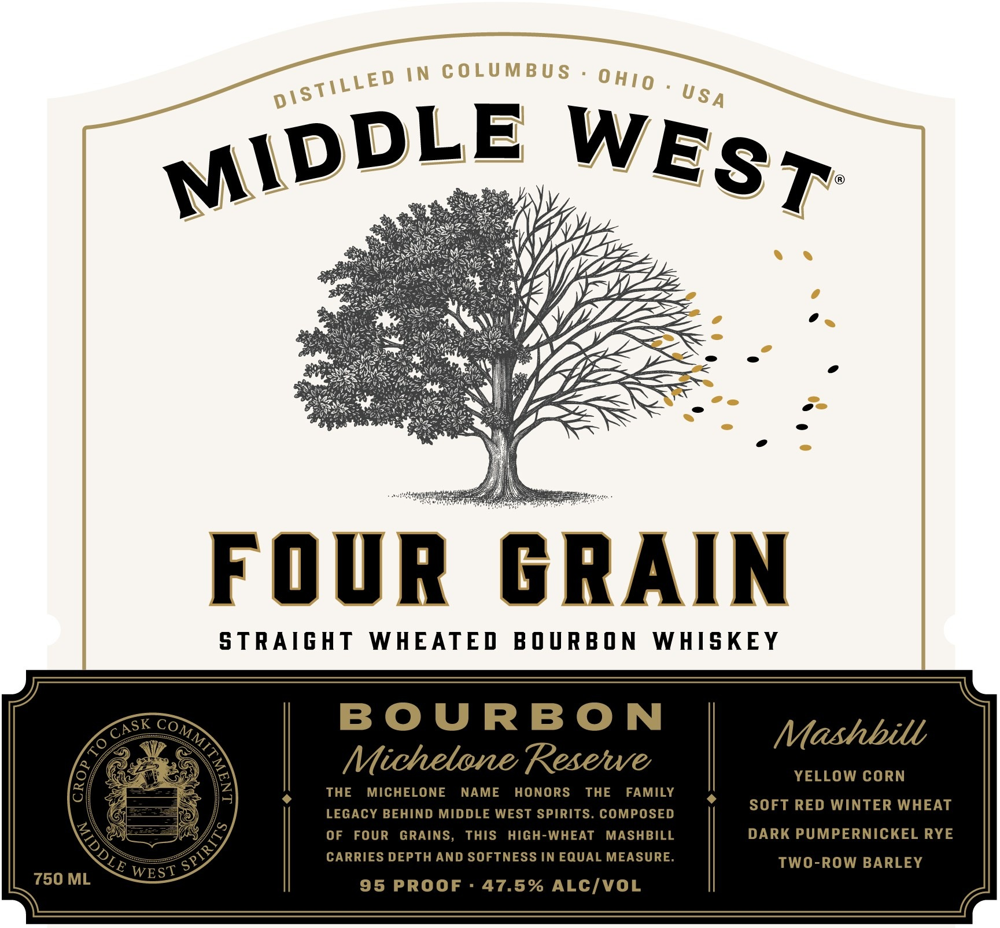
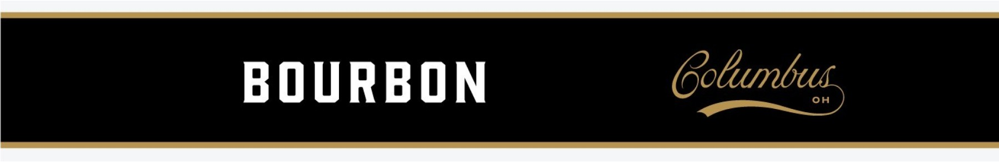

# TTB COLA Label Images - TTBID 26249001000019

**Brand Name:** MIDDLE WEST

**Issue Date:** 09/25/2026

**Origin Code:** 09

**Product Class/Type:** 101

**Source:** [TTB Public COLA Registry](https://ttbonline.gov/colasonline/viewColaDetails.do?action=publicFormDisplay&ttbid=26249001000019)

## Label Images

### Back Label

### Front Label

### Label 3

## Extracted Label Text

*Text extracted via OCR - may contain errors*

*1 image(s) excluded: text did not meet readability threshold*

**Detected Proof:** 95

### Back Label

AT
THE
HEART
OF
OUR
FOUR
GRAIN
BOURBON
IS
OUR
MICHELONE
RESERVE
MASHBILL,
CARRYING
FORWARD
THE
FAMILY
HERITAGE
THAT
MIDDLE
WEST
SPIRITS
WAS
BUILT
ON:
GUIDED
BY
OUR
CROP
To
CASK
APPROACH,
WE
SELECTED
OUR
CORN,
WHEAT
RYE,
AND
BARLEY
FOR
THEIR
DISTINCTIVE
CHARACTER
WHEN
DISTILLED,
CREATING
A
BALANCE
OF
DELICATE
SWEETNESS,
SOFTNESS
AND
SMOOTH
SPICE.
GOVERNMENT
WARNING: (1) ACCORDING TO THE SURGEON GENERAL,
WOMEN SHOULD NOT DRINK ALCOHOLIC BEVERAGES DURING PREGNANCY
BECAUSE
OF
THE
RISK
OF
BIRTH
DEFECTS.   (2)
CONSUMPTION
OF
ALCOHOLIC   BEVERAGES IMPAIRS   YOUR ABILITY TO DRIVE
A
CAR
OR
KOSHER
OPERATE
MACHINERY;
AND
MAY
CAUSE
HEALTH
PROBLEMS.
DISTILLED AND BOTTLED
BY MIDDLE WEST SPIRITS
1165
ALUM
CREEK
DRIVE
COLUMBUS,
OHIO
0
91037140765'
8
MIDDLE
WEST
ACk

### Front Label

IN COLUMBU S
FOvR
GRAIN
S TRAIGHT
WHEATED
B O U RB O N
WHISKEY
Co
B O URBON
Mashbill
Michelone Resetwe
YELLOW CORN
THE
MICHELONE
NAME
HONORS
THE
FAMILY
LEGACY BEHIND MIDDLE WEST SPIRITS. COMPOSED
SOFT RED WINTER WHEAT
OF
FOUR
GRAINS,
ThIS
HIGH-WHEAT
MASHBILL
DARK PUMPERNICKEL RYE
CARRIES DEPTH AND SOFTNESS IN EQUAL MEASURE
TWO-ROW BARLEY
750 ML
WEST
95 PROOF
47.5% ALCIVOL
0 HIO
DISTILLED
USA
MIDDLE
WEST
CASK
)
To
3
1
DLE
