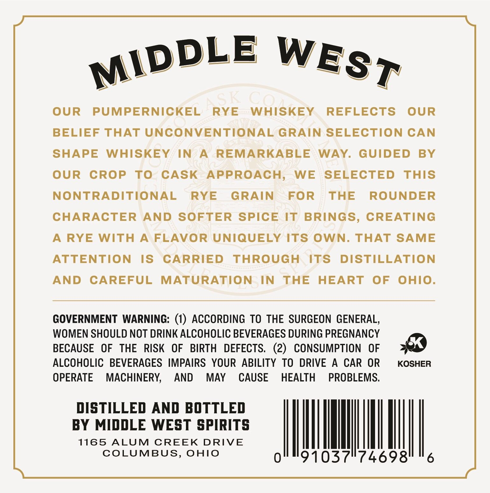
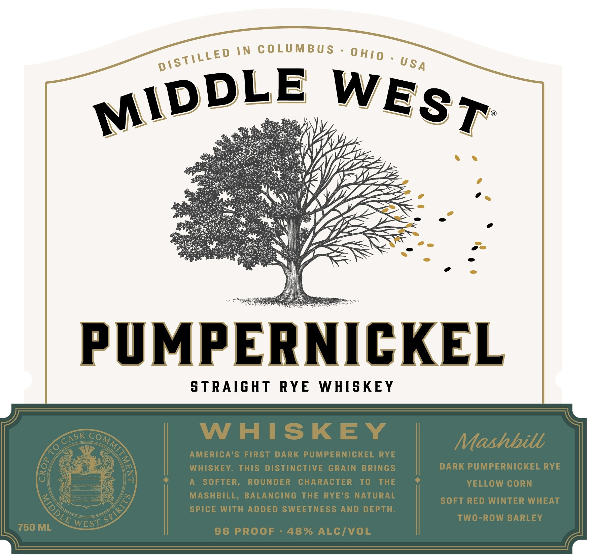

# TTB COLA Label Images - TTBID 26249001000020

**Brand Name:** MIDDLE WEST

**Issue Date:** 09/28/2026

**Origin Code:** 09

**Product Class/Type:** 102

**Source:** [TTB Public COLA Registry](https://ttbonline.gov/colasonline/viewColaDetails.do?action=publicFormDisplay&ttbid=26249001000020)

## Label Images

### Back Label

### Front Label

### Label 3

## Extracted Label Text

*Text extracted via OCR - may contain errors*

*1 image(s) excluded: text did not meet readability threshold*

**Detected Proof:** 96

### Back Label

OUR
PUMPERNICKEL
RYE
WHISKEY
REFLECTS
OUR
BELIEF THAT UNCONVENTIONAL GRAIN SELECTION CAN
SHAPE
WHISKEY
IN
A
REMARKABLE
WAY
GUIDED
BY
OUR
CROP
To
CASK
APPROACH,
WE
SELECTED
ThIS
NONTRADITIONAL
RYE
GRAIN
FOR
THE
ROUNDER
CHARACTER
AND SOFTER SPICE
IT BRINGS, CREATING
A RYE WITH
A
FLAVOR UNIQUELY ITS
OWN. THAT SAME
ATTENTION
IS
CARRIED
THROUGH
ITS
DISTILLATION
AND
CAREFUL
MATURATION
IN
THE
HEART
OF
ohiO_
GOVERNMENT
WARNING: (1) ACCORDING To THE SURGEON GENERAL,
WOMEN SHOULD NOT DRINK ALCOHOLIC BEVERAGES DURING PREGNANCY
BECAUSE
OF
THE
RISK   OF
BIRTH
DEFECTS.   (2)
CONSUMPTION
OF
ALCOHOLIC   BEVERAGES IMPAIRS   YOUR ABILITY TO DRIVE
A
CAR
OR
KOSHER
OPERATE
MACHINERY;
AND
MAY
CAUSE
HEALTH
PROBLEMS.
DISTILLED AND BOTTLED
BY MIDDLE WEST SPIRITS
1165
ALUM
CREEK
DRIVE
COLUMBUS,
OHIO
1037174698'
6
MIDDLE
WEST
PC

### Front Label

IN
COLUMBU S
PUMPERNICKEL
S TRAIGHT
RYE
WHISKEY
WHISKEY
Mashbill
AMERICA'S FIRST
DARK PUMPERNICKEL RYE
WHISKEY. THIS DiSTInCTIVE GRAIN BRINGS
DARK PUMPERNICKEL RYE
SOFTER;
ROUNDER
CHARACTER
To
THE
YELLOW CORN
MASHBILL, BALANCING THE RYE'S NATURAL
SoFT RED WiNTER WHEAT
SPIce With ADDED SWEETNESS AND DEPTH:
TwO-ROw BARLEY
750 ML
WEST
96 PROOF
48% ALCIVOL
DISTILLE D
0 H0
USA
MIDDLE
WEST
CASK
)
1
LE
