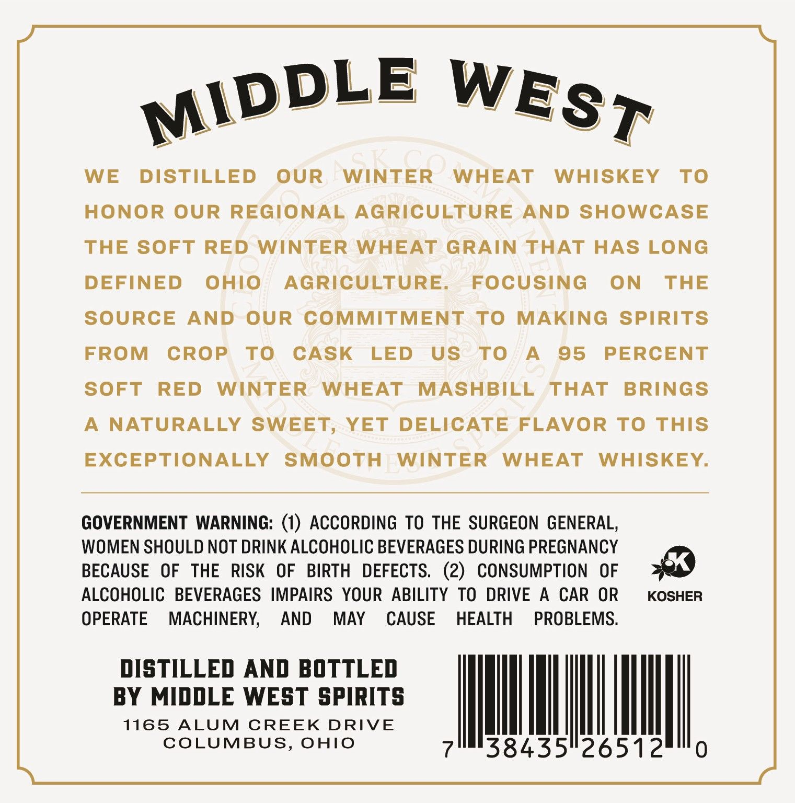
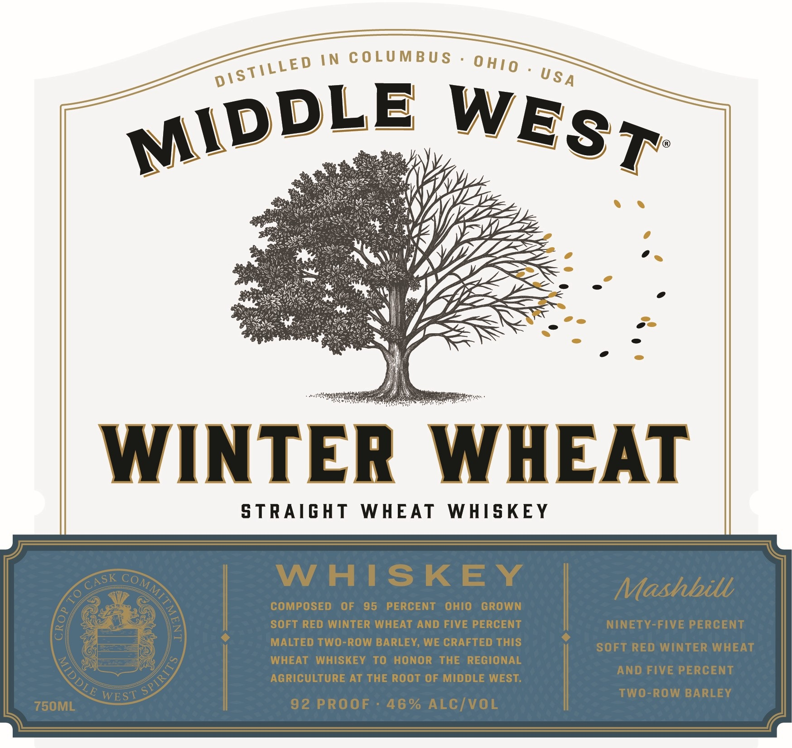

# TTB COLA Label Images - TTBID 26249001000021

**Brand Name:** MIDDLE WEST

**Issue Date:** 09/14/2026

**Origin Code:** 09

**Product Class/Type:** 109

**Source:** [TTB Public COLA Registry](https://ttbonline.gov/colasonline/viewColaDetails.do?action=publicFormDisplay&ttbid=26249001000021)

## Label Images

### Back Label

### Front Label

### Label 3

## Extracted Label Text

*Text extracted via OCR - may contain errors*

*1 image(s) excluded: text did not meet readability threshold*

**Detected Proof:** 92

### Back Label

2
WE
DISTILLED
OUR
WINTER
WHEAT
WHISKEY
To
HONOR OUR REGIONAL AGRICULTURE
AND SHOWCASE
THE SOFT RED
WINTER WHEAT
GRAIN THAT HAS LONG
DEFINED
OhIO
AGRICULTURE
FOCUSING
ON
THE
SOURCE
AND
OUR
COMMITMENT
To
MAKING
SPIRITS
FROM
CROP
To
CASK
LED
US
To
A
95
PERCENT
SOFT
RED
WINTER
WHEAT
MASHBILL
THAT
BRINGS
A
NATURALLY SWEET, YET DELICATE FLAVOR T ThIS
EXCEPTIONALLY
SMOOTH
WINTER
WHEAT
WHISKEY.
GOVERNMENT WARNING: (1) ACCORDING To THE SURGEON GENERAL,
WOMEN SHOULD NOT DRINK ALCOHOLIC BEVERAGES DURING PREGNANCY
BECAUSE
OF
THE
RISK   OF
BIRTH
DEFECTS,
(2)
CONSUMPTION
OF
ALCOHOLIC   BEVERAGES IMPAIRS  YOUR ABILITY TO DRIVE
A
CAR
OR
KOSHER
OPERATE
MACHINERY,
AND
MAY
CAUSE
HEALTH
PROBLEMS.
DISTILLED AND BOTTLED
BY MIDDLE WEST SPIRITS
1165
ALUM
CREEK
DRIVE
COLUMBUS, OHIO
38435"26512
MIDDLE
WEST

### Front Label

IN
C 0LUMBU $
WINTER
WHEAT
S TRAIGHT
WHEAT
WHISKEY
W HISKEY
Mashbill
COMPOSED
OF
95
PERCENT
OHIO
GROWN
SOFT RED WINTER WHEAT AND FIVE PERCENT
NINETY-FIVE PERCENT
MALTED TWO-ROW BARLEY, WE CRAFTED THIS
SOFT RED WINTER WHEAT
WHEAT
WHISKEY To HonOR THE REGIONAL
AND FIVE PERCENT
AGRICULTURE AT THE Root OF MIDDLE WEST:
WEST
TwO-ROW BARLEY
75OML
92 PROOF
46 % ALCIVOL
0 HI0
DSTILLED
U SA
MIDDLE
WEST
CASK
COMMI
0
LE
