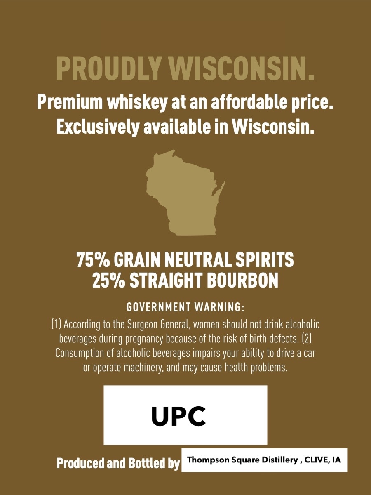
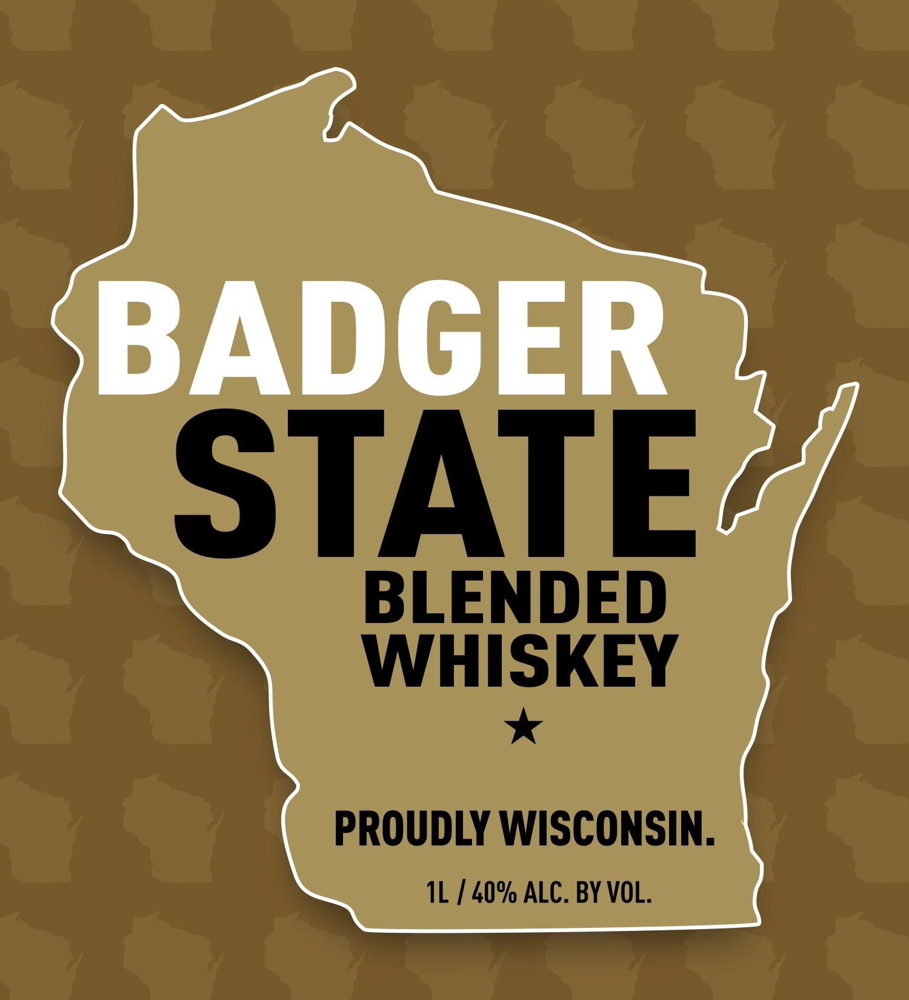

# TTB COLA Label Images - TTBID 26249001000060

**Brand Name:** BADGER STATE

**Issue Date:** 09/15/2026

**Origin Code:** 20

**Product Class/Type:** 137

**Source:** [TTB Public COLA Registry](https://ttbonline.gov/colasonline/viewColaDetails.do?action=publicFormDisplay&ttbid=26249001000060)

## Label Images

### Back Label

### Front Label

## Extracted Label Text

*Text extracted via OCR - may contain errors*

### Back Label

PROUDLY WISCONSIN
Premium whiskey at an affordable price:
Exclusively available in Wisconsin:
75% CRAIN NEUTRAL SPIRITS
25% STRAICHT BOURBON
GOVERNMENT WARNiNG:
(1) According to the Surgeon General; women should not drink alcoholic
beverages
pregnancy because of the risk of birth defects. (2)
Consumption of alcoholic beverages impairs your ability to drive a car
Or
operate machinery, and may cause health problems.
UPC
Produced and Bottled by|  Thompson Square Distillery
CLIVE, IA
during `

### Front Label

BADGER

STAT

BLENDED

WHISKEY

Saba
