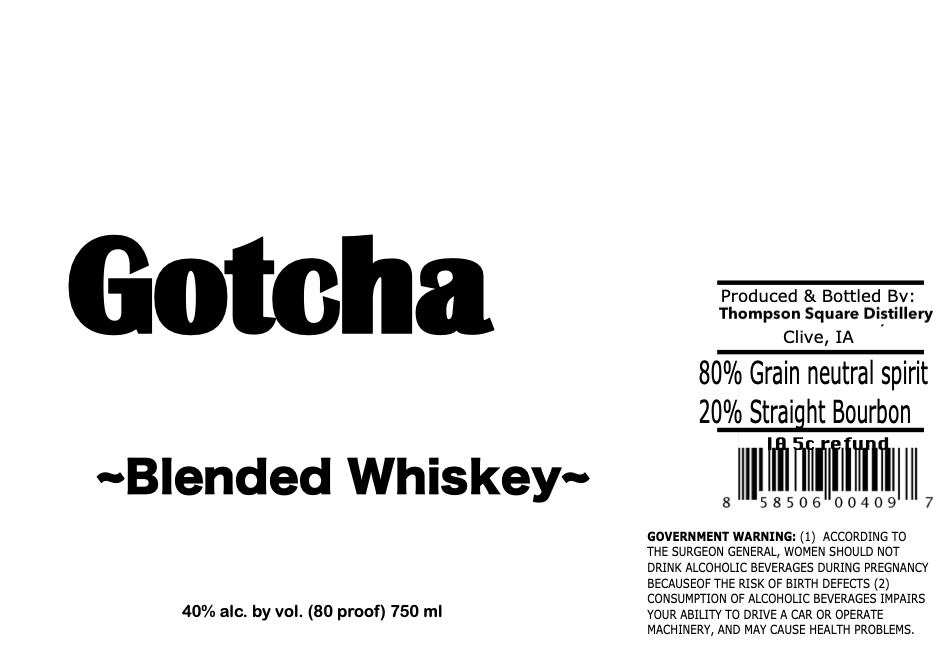

# TTB COLA Label Images - TTBID 26249001000065

**Brand Name:** GOTCHA

**Issue Date:** 09/21/2026

**Origin Code:** 20

**Product Class/Type:** 137

**Source:** [TTB Public COLA Registry](https://ttbonline.gov/colasonline/viewColaDetails.do?action=publicFormDisplay&ttbid=26249001000065)

## Label Images

### Back Label

## Extracted Label Text

*Text extracted via OCR - may contain errors*

**Detected Proof:** 80

### Back Label

Produced & Bottled By

Thompson Square Distillery

Gotcha

Clive, IA

80% Grain neutral spirit

20% Straight Bourbon

~Blended Whiskey~

iii

58506

Mt

GOVERNMENT WARNING: (1) ACCORDING TO

‘THE SURGEON GENERAL, WOMEN SHOULD NOT

DRINK ALCOHOLIC BEVERAGES DURING PREGNANCY

BECAUSEOF THE RISK OF BIRTH DEFECTS (2)

CONSUMPTION OF ALCOHOLIC BEVERAGES IMPAIRS

40% alc. by vol. (80 proof) 750 ml

YOUR ABILITY TO DRIVE A CAR OR OPERATE

MACHINERY, AND MAY CAUSE HEALTH PROBLEMS.
