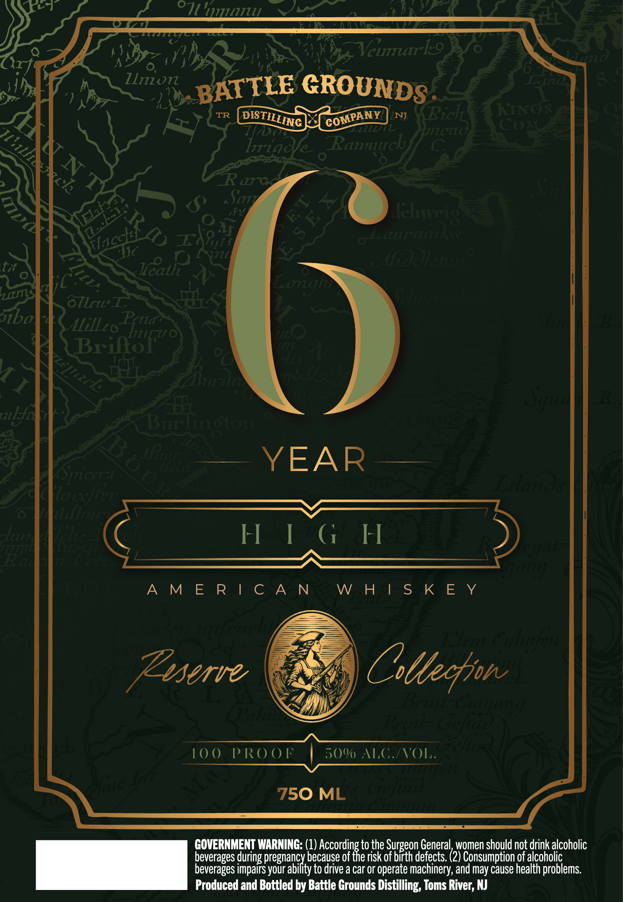

# TTB COLA Label Images - TTBID 26250001000041

**Brand Name:** BATTLE GROUNDS DISTILLING COMPANY

**Issue Date:** 09/14/2026

**Origin Code:** 03

**Product Class/Type:** 140

**Source:** [TTB Public COLA Registry](https://ttbonline.gov/colasonline/viewColaDetails.do?action=publicFormDisplay&ttbid=26250001000041)

## Label Images

### Label 1

## Extracted Label Text

*Text extracted via OCR - may contain errors*

### Label 1

'11l1l
'HRL
Vcumurrko
Zliion
GROUNDS
TR
NJ
RiclL
HG ?
GOAt
"1e1C1
liad
Raunrck
4
R
1
8
S7
4
St
4}
0
QuFFAna)
3
1774
iloelclae
Ir
~
Longm
zms
6Tlriu

Jbol
Alillzo Pcrta,

3
Fzcz/ e
Zo
Brilof

Y
KLus

Tya
Burninoto
3
JlLLtict
YEAR
SiCEr71

laceffuj:
Lillirtiis
3
~Ectze
Uekca
H [ 6 H
Ea
3
e

A M E R | C A N
W H | S K E Y
3

rlugten
Zsserve
Cttecfjn
'
Faan
3

eulantng
10 0
P RO 01
5o% ALG /VOL.
St
ate I
dn
750 ML
3
GOVERNMENT WARNING: (1)
Cacserditxes
to the Surgeon General women should not drink alcoholic
beverages =
pregnancy because of
risk of birth defects. (2) Consumption of alcoholic
beverages impairs your ability to drive a car or operate machinery, and may Cause health problems
Produced and Bottled by Battle Grounds Distilling, Toms River; NJ
071
BATTLE
DISTILLING
COMPANY
E
Iclvri8
3
Vacchf?
18348
6h
IIIA
VI
Trzchs
Sn

1
1

during
