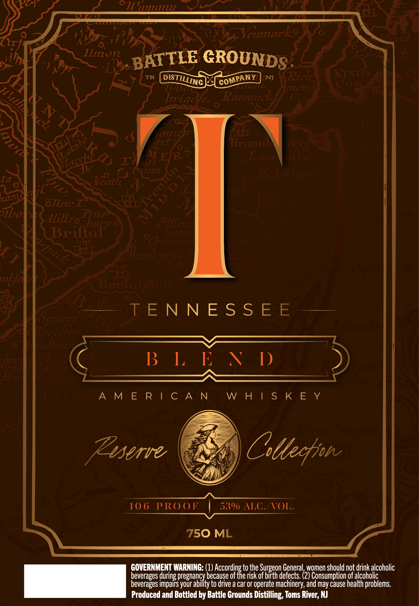

# TTB COLA Label Images - TTBID 26250001000042

**Brand Name:** BATTLE GROUNDS DISTILLING COMPANY

**Issue Date:** 09/16/2026

**Origin Code:** 03

**Product Class/Type:** 140

**Source:** [TTB Public COLA Registry](https://ttbonline.gov/colasonline/viewColaDetails.do?action=publicFormDisplay&ttbid=26250001000042)

## Label Images

### Label 1

## Extracted Label Text

*Text extracted via OCR - may contain errors*

### Label 1

071
YBRL
Vcumurrkeo
Zliion
GROUNDS
TR
NJ
Riclt
HIIC?
ZDL
Jielti
COat
lnad
Raunutrcb
Scti
5
LNTT
F1L
pri
1
t
VTEfR $
oLaur
Z465
Uf € <
UJc
0 fuz
ioaictuo
I0
Jcatll
zms
oTlru
clan
Jibal
AilLzo
e_OLLLatiza
Brilof:
ittiiit
aifin

Buuneton
3
SpicEr 1
HAT E N N E S $ E E
3
lacefhj?
zlanitiin
Jur
Vekec@

B L % W D)
aa
Vi

A M E R | C A N
W H | S K E Y
2

3
gi
Zsserve
Gttecfjn

3=

10 6
P RO 0F
530 ALG.FVOL

3
750 ML
38
GOVERNMENT WARNING: (1)
Cacserdites
to the Surgeon General, women should not drink alcoholic
beverages during pregnancy because of
risk of birth defects. (2) Consumption of alcoholic
beverages impairs your ability to drive a car or operate machinery, and may cause health problems
Produced and Bottled by Battle Grounds Distilling, Toms River; NJ
"111714
BATTLE
DISTILLING
COMPANY
VIO
TfAccht
8
MLD D I
X
8
1
Taurze
0cramie
Zcucl
V I

[alyn
3
1
1
3
