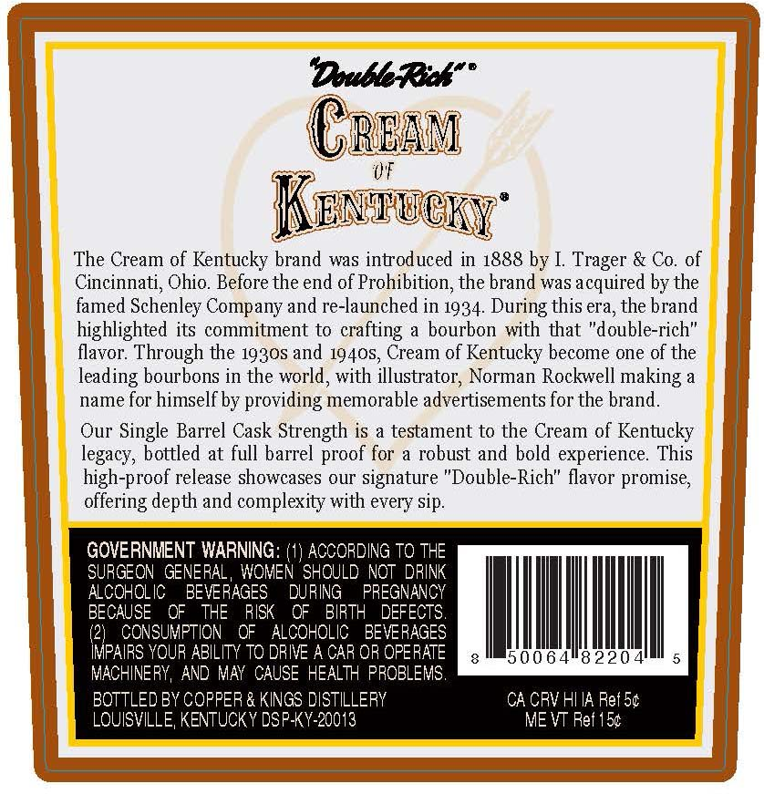
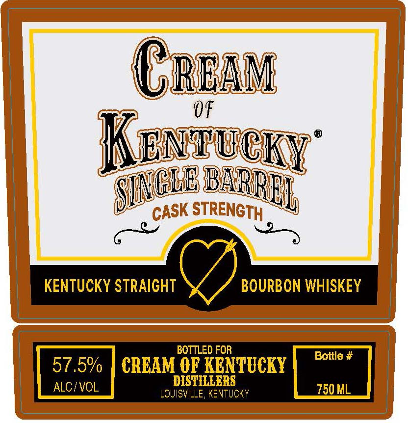

# TTB COLA Label Images - TTBID 26250001000047

**Brand Name:** CREAM OF KENTUCKY

**Fanciful Name:** SINGLE BARREL

**Issue Date:** 09/15/2026

**Origin Code:** 22

**Product Class/Type:** 101

**Source:** [TTB Public COLA Registry](https://ttbonline.gov/colasonline/viewColaDetails.do?action=publicFormDisplay&ttbid=26250001000047)

## Label Images

### Back Label

### Front Label

## Extracted Label Text

*Text extracted via OCR - may contain errors*

**Detected Proof:** 115

### Back Label

DoubeRukF
CREAV
"0F
Kentecky"
The Cream of Kentucky brand was introduced in 1888 by I
& Co. of
Cincinnati; Ohio Before the end of Prohibition, the brand was acquired by the
famed Schenley Company and re-launched in 1934. During this era; the brand
highlighted its commitment to crafting a bourbon with that "double-rich"
flavor. Through the 1930S and 1940S, Cream of Kentucky become one of the
leading bourbons in the world, with illustrator; Norman Rockwell making a
name for himself by providing memorable advertisements for the brand.
Our
Single Barrel Cask Strength is a testament to the Cream of Kentucky
legacy, bottled at full barrel proof for
a robust and bold experience.
This
high-proof release showcases our signature "Double-Rich" flavor promise;
offering depth and complexity with every sip.
GOVERNMENT WARNING:
ACCORDING TO THE
SURGEON GENERAL
WOMEN SHOULD NOT DRINK
ALCOHOLIC
BEVERAGES
DURING
PREGNANCY
BECAUSE
OF
THE
RISK
OF
BIRTH
DEFECTS,
(21
CONSUMPTION
QF
ALCOHOLIC
BEVERAGES
IMPAIRS YOUR ABILITY TQ DRIVE A CAR OR OPERATE
50064"8220
MACHINERY, AND MAY  CAUSE HEALTH PROBLEMS,
BOTTLED BY COPFER & KINGS DISTILLERY
CA CRV HI IA Ref 54
LQUISVILLE; KENTUCKY DSPKY-20013
ME VT Ref 154
Trager

### Front Label

Cream
0F
Kwntucr
'STRENGTH
KENTUCKY STRAIGHT
BOURBON WHISKEY
BOTTLED FOR
Bottle #
57.5%
CRCAM OF KENTUCKY
ALCIVOL
DISTILLERS
750 ML
LQUISVILLE , KENTUCKY
SCLB
 BARREL
CASK
