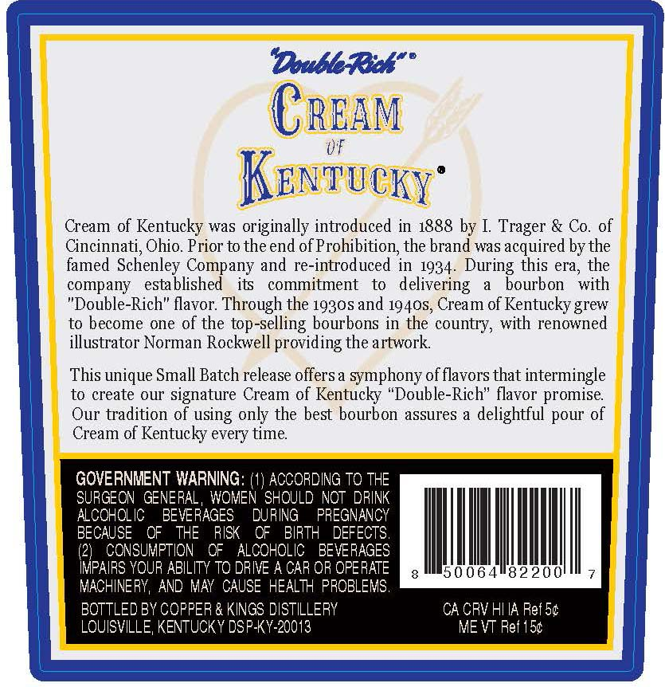
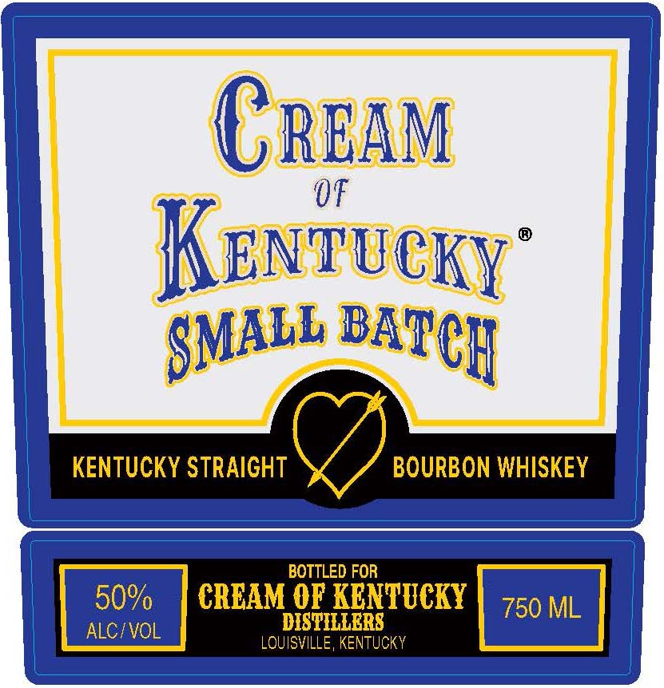

# TTB COLA Label Images - TTBID 26250001000048

**Brand Name:** CREAM OF KENTUCKY

**Issue Date:** 09/15/2026

**Origin Code:** 22

**Product Class/Type:** 101

**Source:** [TTB Public COLA Registry](https://ttbonline.gov/colasonline/viewColaDetails.do?action=publicFormDisplay&ttbid=26250001000048)

## Label Images

### Back Label

### Front Label

## Extracted Label Text

*Text extracted via OCR - may contain errors*

**Detected Proof:** 100

### Back Label

"DoubbRul"=
CREAM
Df
Kentucky
Cream of Kentucky was originally introduced in 1888 by I Trager & Co. of
Cincinnati; Ohio. Prior to the end of Prohibition;, the brand was acquired by the
famed Schenley Company
re-introduced in 1934. During this era, the
company
esta blished
its
commitment
to
delivering
bourbon
with
"Double-Rich" flavor: Through the 19305 and 1940S, Cream of Kentucky grew
to become one of the top-selling bourbons in the country, with renowned
illustrator Norman Rockwell providing the artwork
This unique Small Batch release offers a symphony of flavors that intermingle
to create our signature Cream of Kentucky
'Double-Rich" flavor promise
Our tradition of
only the best bourbon assures a delightful pour of
Cream of Kentucky every time
GOVERNMENT WARNING:
ACCORDING TQ THE
SURGEON GENERAL , WQMEN 'SHOULD NOT DRINK
ALCOHOLIC
BEVERAGES
DURING
PREGNANCY
BECAUSE
OF
THE
RISK
QF
BIRTH
DEFECTS.
(2}
CONSUMPTION
QF
ALCOHOLIC
BEVERAGES
IMPAIRS YOUR ABILITY TQ DRIVE A CAR OR OPERATE
50064"82200
MACHINERY, AND MAY  CAUSE HEALTH PROBLEMS .
BOTTLED BY COPPER & KINGS DISTILLERY
CA CRV HI IA Ref 54
LOUISVILLE; KENTUCKY DSPKY-20013
ME VT Ref 154
and
using

### Front Label

CREaM
OF
Kenvucky
KENTUCKY STRAIGHT
BOURBON WHISKEY
BOTTLED FOR
50%
CRCAM OF KENTUCKY
750 ML
ALCIVOL
DISTILLERS
LOUISVILLE, KENTUCKY
SMALL
BATCH
