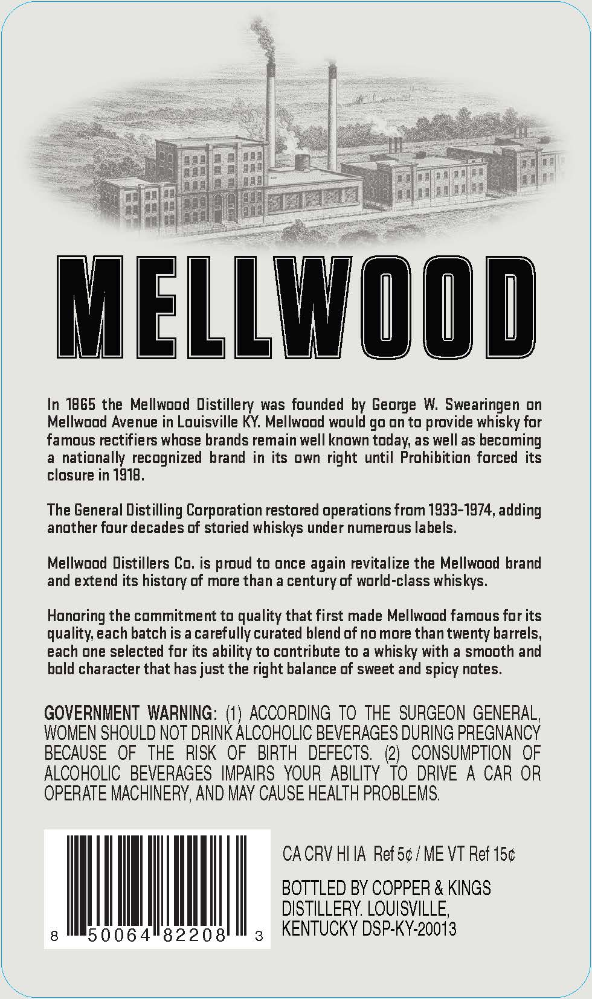
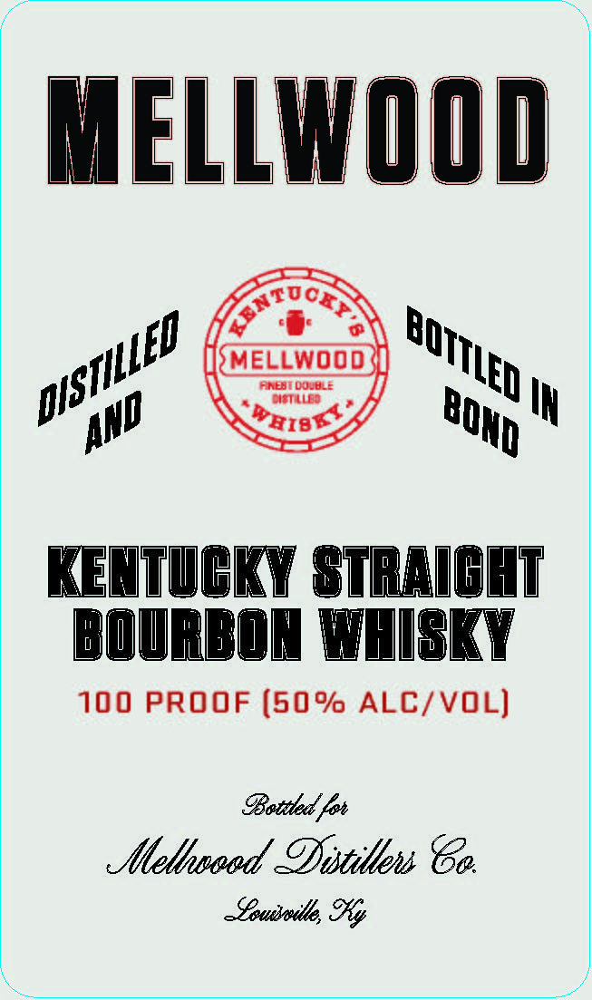

# TTB COLA Label Images - TTBID 26250001000049

**Brand Name:** MELLWOOD

**Issue Date:** 09/15/2026

**Origin Code:** 22

**Product Class/Type:** 101

**Source:** [TTB Public COLA Registry](https://ttbonline.gov/colasonline/viewColaDetails.do?action=publicFormDisplay&ttbid=26250001000049)

## Label Images

### Back Label

### Front Label

## Extracted Label Text

*Text extracted via OCR - may contain errors*

**Detected Proof:** 100

### Back Label

al

in| ae

f

MELLWOOD

In 1865 the Mellwood Distillery was founded by George W. Swearingen on

Mellwood Avenue in Louisville KY. Mellwood would go on to provide whisky for

famous rectifiers whose brands remain well known today, as well as becoming

a nationally recognized brand in its own right until Prohibition forced its

closure in 1918

The General Distilling Corporation restored operations from 1933-1974, adding

another four decades of storied whiskys under numerous labels

Mellwood Distillers Co. is proud to once again revitalize the Mellwood brand

and extend its history of more than a century of world-class whiskys

Honoring the commitment to quality that first made Mellwood famous for its

quality, each batch is a carefully curated blend of no more than twenty barrels,

each one selected for its ability to contribute to a whisky with a smooth and

bold character that has just the right balance of sweet and spicy notes

GOVERNMENT WARNING: (1) ACCORDING TO THE SURGEON GENERAL

WOMEN SHOULD NOT DRINK ALCOHOLIC BEVERAGES DURING PREGNANCY

BECAUSE OF THE RISK OF BIRTH DEFECTS. (2) CONSUMPTION OF

ALCOHOLIC BEVERAGES IMPAIRS YOUR ABILITY TO DRIVE A CAR OR

OPERATE MACHINERY, AND MAY CAUSE HEALTH PROBLEMS

CACRV HIIA Ref 5¢/ME VT Ref 15¢

BOTTLED BY COPPER & KINGS

DISTILLERY. LOUISVILLE

|

50064"82208

ll

KENTUCKY DSP-KY-20013

### Front Label

MELLWOOD
Gtoor
MELLWOOD
fnebt durble
CistlleD
IN
KENTvGKY STREIGHT
BOURBON WHISKY
100 PROOF (50% ALC/VOL)
Iettted {ot
xlethseed 9istilli 8e
~epuesoiths
BOTTLED '
DISTILLED
BOrD
AND
WEIBS
%y
