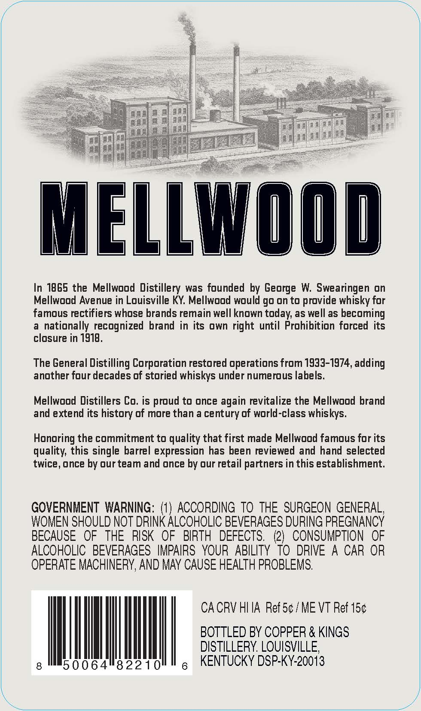
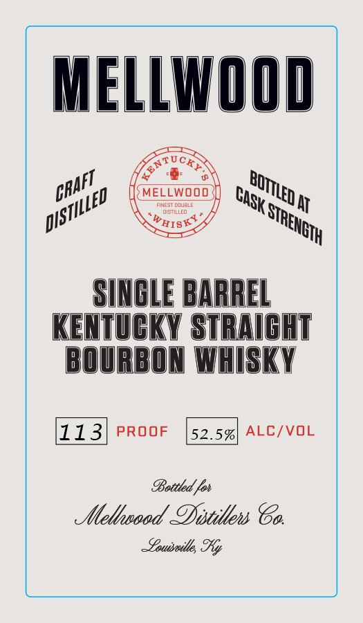

# TTB COLA Label Images - TTBID 26250001000051

**Brand Name:** MELLWOOD

**Fanciful Name:** SINGLE BARREL

**Issue Date:** 09/28/2026

**Origin Code:** 22

**Product Class/Type:** 101

**Source:** [TTB Public COLA Registry](https://ttbonline.gov/colasonline/viewColaDetails.do?action=publicFormDisplay&ttbid=26250001000051)

## Label Images

### Back Label

### Front Label

## Extracted Label Text

*Text extracted via OCR - may contain errors*

**Detected Proof:** 113

### Back Label

aula

Pelee

ii

Cis

o

MELLWOOD

In 1865 the Mellwood Distillery was founded by George W. Swearingen on

Mellwood Avenue in Louisville KY. Mellwood would go on to provide whisky for

famous rectifiers whose brands remain well known today, as well as becoming

a nationally recognized brand in its own right until Prohibition forced its

closure in 1918.

The General Distilling Corporation restored operations from 1933-1974, adding

another four decades of storied whiskys under numerous labels.

Mellwood Distillers Co. is proud to once again revitalize the Mellwood brand

and extend its history of more than a century of world-class whiskys.

Honoring the commitment to quality that first made Mellwood famous for its

quality, this single barrel expression has been reviewed and hand selected

twice, once by our team and once by our retail partners in this establishment.

GOVERNMENT WARNING: (1) ACCORDING TO THE SURGEON GENERAL,

WOMEN SHOULD NOT DRINK ALCOHOLIC BEVERAGES DURING PREGNANCY

BECAUSE OF THE RISK OF BIRTH DEFECTS. (2) CONSUMPTION OF

ALCOHOLIC BEVERAGES IMPAIRS YOUR ABILITY TO DRIVE A CAR OR

OPERATE MACHINERY, AND MAY CAUSE HEALTH PROBLEMS.

CACRV HIIA Ref5¢/ME VT Ref 15¢

BOTTLED BY COPPER & KINGS

DISTILLERY. LOUISVILLE,

|

ILI

50064"82210

g KENTUCKY DSP-KY-20013

### Front Label

MELLWOOD
MELLWOOD
FINESI LIuBLE
At
distilled
WHISKI
SINCLE BARREL
KENTUCKY STRAICHT
BOURBON WHISKY
113
PROOF
52.5%
ALC/VOL
9ottted Fot
stethoood Oistitlens 86
~eousoitle %y
ENT
GRAFT
BOTTLED E
CAsK F
DISTILLED
STRENGTH
