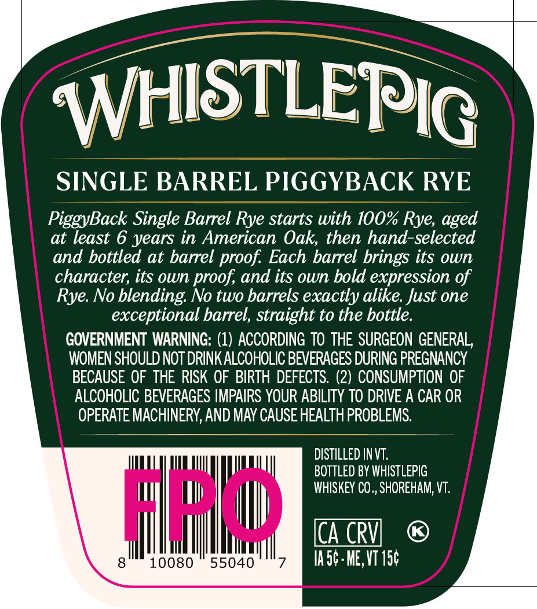
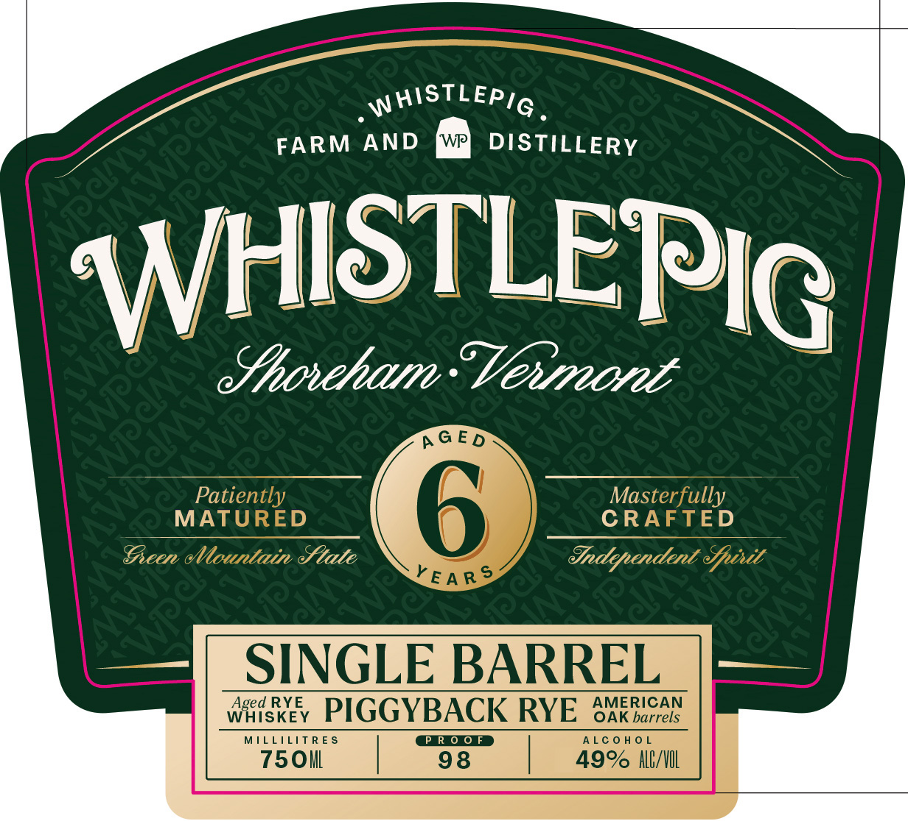
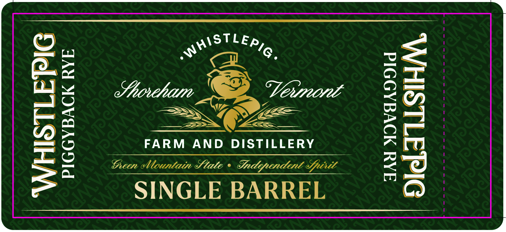
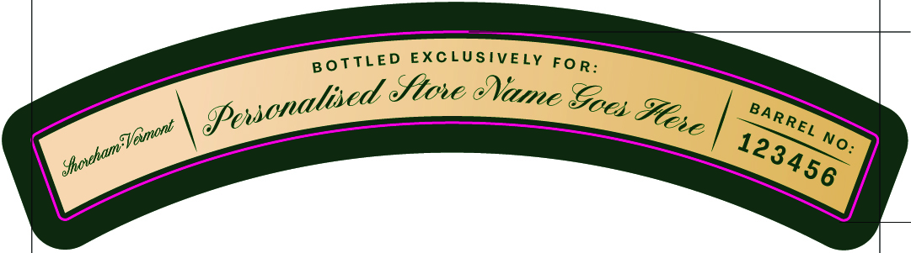

# TTB COLA Label Images - TTBID 26250001000190

**Brand Name:** WHISTLEPIG

**Issue Date:** 09/15/2026

**Origin Code:** 22

**Product Class/Type:** 142

**Source:** [TTB Public COLA Registry](https://ttbonline.gov/colasonline/viewColaDetails.do?action=publicFormDisplay&ttbid=26250001000190)

## Label Images

### Back Label

### Front Label

### Label 2

### Label 3

## Extracted Label Text

*Text extracted via OCR - may contain errors*

**Detected Age:** 6 Years

### Back Label

WHISTLEL
SINGLE BARREL PIGGYBACK RYE
PiggyBack Single Barrel Rye starts with 100% Rye;
at least 6 years in American Oak, then hand-selected
and bottled at barrel proof Each barrel brings its own
character; its own proof; and its own bold expression of
Rye: No blending No two barrels exactly alike: Just one
exceptional barrel, straight to the bottle.
GOVERNMENT WARNING: (1) ACCORDING TO THE SURGEON GENERAL;
WOMEN SHOULD NOT DRINK ALCOHOLIC BEVERAGES DURING PREGNANCY
BECAUSE OF  THE RISK OF BIRTH  DEFECTS   (2) CONSUMPTION OF
ALCOHOLIC BEVERAGES IMPAIRS YOUR ABILITY TO DRIVE A CAR OR
OPERATE MACHINERY, AND MAY CAUSE HEALTH PROBLEMS
DISTILLED INVT:
BOTTLED BY WHISTLEPIG
WHISKEY CO ,, SHOREHAM; VT:
@eu
[CA CRV]
10080
55040
Ia5c . ME, VT 150
PIG
aged

### Front Label

—

FARM AND DISTILLERY

SSS

JHISTLER Ig

| Aoretan Veuve

Pati

MAT

D

SRAt ally

war’

ED

fie

Stale

Sndypen

SINGLE BARREL

ged RYE

AMERICAN

WHISKEY

ILLILITRES

PIGGYBACK RY

PROOF

ALCOHOL

OAK barrels

750i

98

|

49% NO/NOL

|

### Label 2

©
e
ar
2

-PIGGYBACK RYE

\ST LEp
Rs Gg,

N
Shorhan Vewruv

_E=>. —=

FARM AND DISTILLERY

Gen Mountain Slate + Sndypendeant Sptrit

SINGLE BARREL

JAY MOVEADDId

### Label 3

EXCLUSIVELY
FO R:
dtove eame =
No_
BoTTLED
Povsonalised e
Soes
%lece
BARREL
ShoxhamTVemont
123456
